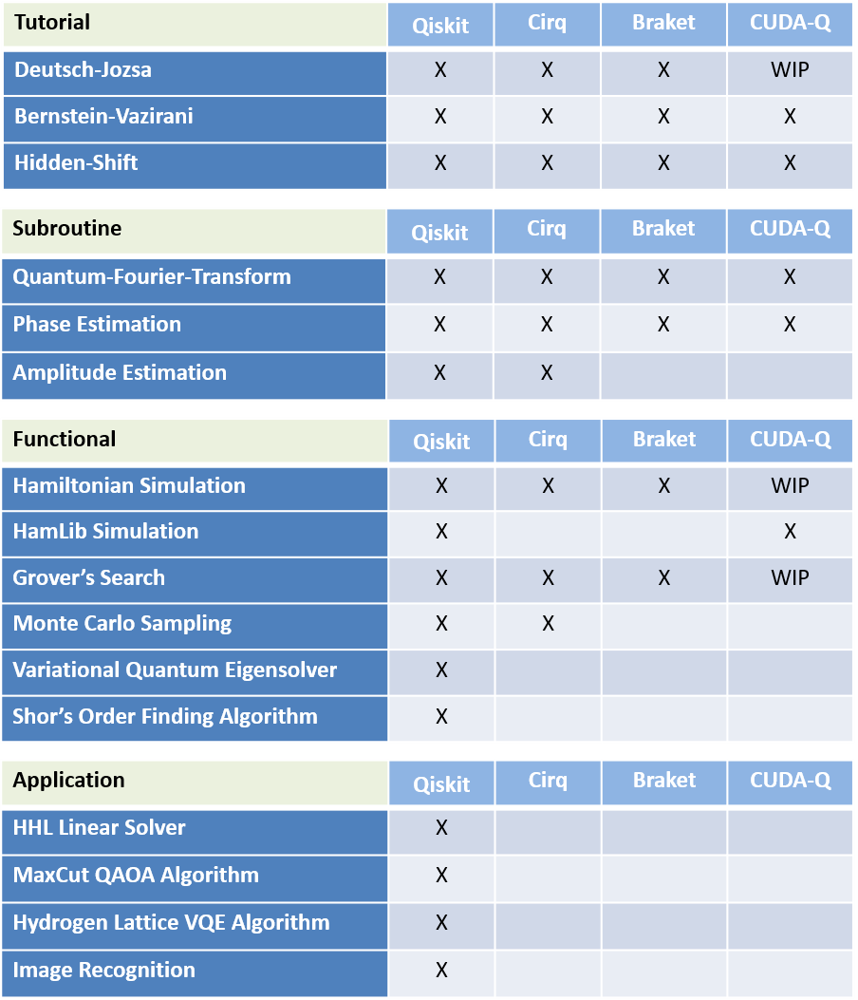

# Application-Oriented Performance Benchmarks for Quantum Computing

> **⚠️ Version 2.0 — Major Restructure:**
> This repository has been significantly restructured. The shared library code (formerly `_common/`) is now **qedclib**, and all benchmarks have moved into **qedcbench/**. A single `pip install -e .` installs both packages. If you have existing code that depends on the previous repository structure, use branch **[master-260411-v1.2.2](https://github.com/SRI-International/QC-App-Oriented-Benchmarks/tree/master-260411-v1.2.2)** for compatibility. See the [User Guide](./doc/docs/user_guide.md#upgrading-from-v1x) for migration details.

This repository contains a collection of prototypical application- or algorithm-centric benchmark programs designed for the purpose of characterizing the end-user perception of the performance of current-generation Quantum Computers.

The repository is maintained by members of the Quantum Economic Development Consortium (QED-C) Technical Advisory Committee on Standards and Performance Metrics (Standards TAC).

**Important Note:** The examples maintained in this repository are not intended to be viewed as "performance standards". Rather, they are offered as simple "prototypes", designed to make it as easy as possible for users to execute simple "reference applications" across multiple quantum computing APIs and platforms.

## Getting Started

```bash
git clone https://github.com/SRI-International/QC-App-Oriented-Benchmarks.git
cd QC-App-Oriented-Benchmarks
pip install -e .
cd qedcbench/hidden_shift
python hs_benchmark.py --api qiskit --min_qubits 2 --max_qubits 6
```

For detailed instructions, see the [Quick Start](./doc/quick_start.md) guide.

## Documentation

**[Full Documentation Site](https://sri-international.github.io/QC-App-Oriented-Benchmarks/)** — Quick start, user guide, benchmark descriptions, and setup guides.

| Document | Description |
|----------|-------------|
| [Quick Start](./doc/docs/quick_start.md) | Install and run your first benchmark |
| [User Guide](./doc/docs/user_guide.md) | Complete reference for all features |
| [Release Notes](./doc/docs/release_notes.md) | Version history and changes |
| [Known Issues](./doc/docs/known_issues.md) | Problems, anomalies, and limitations |
| [About](./doc/docs/about.md) | Project background, structure, and credits |
| [Setup Guides](./doc/docs/setup/) | Platform-specific installation (Qiskit, CUDA-Q, etc.) |

## Benchmark Complexity Levels

```
Level 1: Deutsch-Jozsa, Bernstein-Vazirani, Hidden Shift
Level 2: Quantum Fourier Transform, Grover's Search
Level 3: Phase Estimation, Amplitude Estimation, HHL Linear Solver
Level 4: Monte Carlo, Hamiltonian Simulation, HamLib, VQE, Shor's Algorithm
Level 5: MaxCut, Hydrogen Lattice, Image Recognition
```

## Publications

&nbsp;&nbsp;&nbsp;&nbsp;[Application-Oriented Performance Benchmarks for Quantum Computing](https://arxiv.org/abs/2110.03137) (Oct 2021)

&nbsp;&nbsp;&nbsp;&nbsp;[Optimization Applications as Quantum Performance Benchmarks](https://arxiv.org/abs/2302.02278) (Feb 2023)

&nbsp;&nbsp;&nbsp;&nbsp;[Quantum Algorithm Exploration using Application-Oriented Performance Benchmarks](https://arxiv.org/abs/2402.08985) (Feb 2024)

&nbsp;&nbsp;&nbsp;&nbsp;[A Comprehensive Cross-Model Framework for Benchmarking the Performance of Quantum Hamiltonian Simulations](https://arxiv.org/abs/2409.06919) (Sep 2024)

&nbsp;&nbsp;&nbsp;&nbsp;[A Practical Framework for Assessing the Performance of Observable Estimation in Quantum Simulation](https://arxiv.org/abs/2504.09813) (Apr 2025)

&nbsp;&nbsp;&nbsp;&nbsp;[Platform-Agnostic Modular Architecture for Quantum Benchmarking](https://arxiv.org/abs/2510.08469) (2025)

## Implementation Status



<br>
&copy; 2025 Quantum Economic Development Consortium (QED-C). All Rights Reserved.
