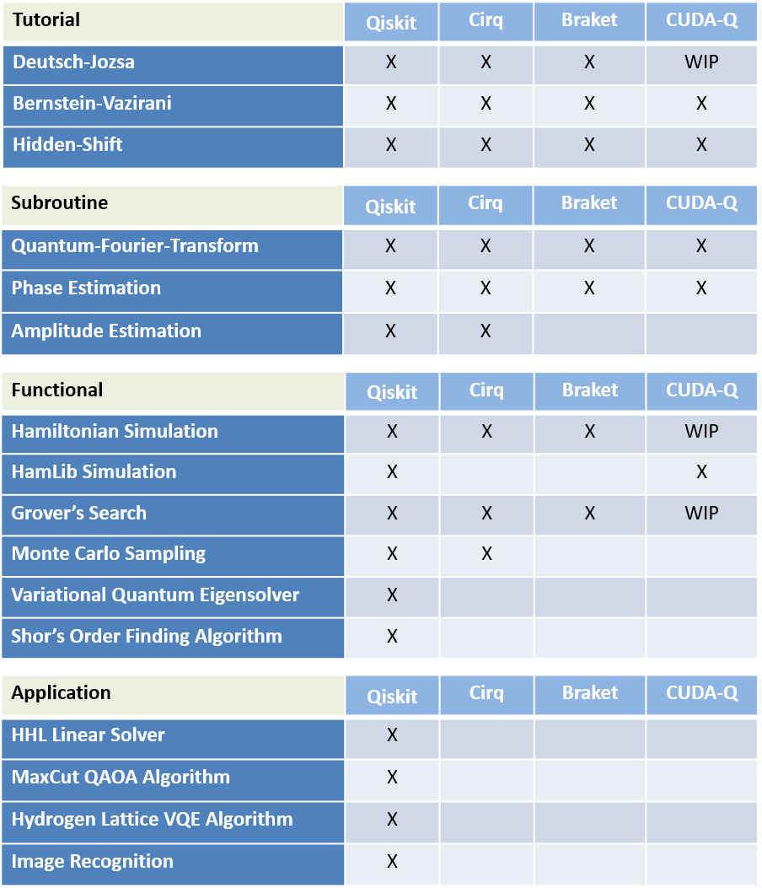

# Application-Oriented Performance Benchmarks for Quantum Computing

This repository contains a collection of prototypical application- or algorithm-centric benchmark programs designed for the purpose of characterizing the end-user perception of the performance of current-generation Quantum Computers.

The repository is maintained by members of the Quantum Economic Development Consortium (QED-C) Technical Advisory Committee on Standards and Performance Metrics (Standards TAC).

**Important Status Update --** As of 251222, any benchmark directory with a dash in its name, e.g. **hidden-shift**, has been renamed to use underbar instead, i.e. **hidden_shift**, and all references changed accordingly. This means that existing scripts or notebooks that reference these directories will need to be modified.  To ease the transition, a complete backup branch, **master-251220-v1**, of the state of the repository prior to this change has been created for use with existing scripts and notebooks.

**Important Note --** The examples maintained in this repository are not intended to be viewed as "performance standards". Rather, they are offered as simple "prototypes", designed to make it as easy as possible for users to execute simple "reference applications" across multiple quantum computing APIs and platforms. The application / algorithmic examples are structured using a uniform pattern for defining circuits, executing across different platforms, collecting results, and measuring performance and fidelity in useful ways. 

A variety of "reference applications" are provided. At the current stage in the evolution of quantum computing hardware, some applications will perform better on one hardware target, while a completely different set may execute better on another target. They are designed to provide users a quantum "jump start", so to speak, eliminating the need to develop for themselves uniform code patterns that facilitate quick development, deployment, and experimentation. 

The QED-C committee released its first paper (Oct 2021) describing the theory and methodology supporting this work at

&nbsp;&nbsp;&nbsp;&nbsp;[Application-Oriented Performance Benchmarks for Quantum Computing](https://arxiv.org/abs/2110.03137)

The QED-C committee released a second paper (Feb 2023) describing the addition of combinatorial optimization problems as advanced application-oriented benchmarks at

&nbsp;&nbsp;&nbsp;&nbsp;[Optimization Applications as Quantum Performance Benchmarks](https://arxiv.org/abs/2302.02278)

The group added another paper (Feb 2024) with additional benchmark programs and improvements to the framework at

&nbsp;&nbsp;&nbsp;&nbsp;[Quantum Algorithm Exploration using Application-Oriented Performance Benchmarks](https://arxiv.org/abs/2402.08985)

The group released a fourth paper (Sep 2024) and a fifth (Apr 2025) with a deep focus on measuring performance of Quantum Hamiltonians Simulations at

&nbsp;&nbsp;&nbsp;&nbsp;[A Comprehensive Cross-Model Framework for Benchmarking the Performance of Quantum Hamiltonian Simulations](https://arxiv.org/abs/2409.06919)

&nbsp;&nbsp;&nbsp;&nbsp;[A Practical Framework for Assessing the Performance of Observable Estimation in Quantum Simulation](https://arxiv.org/abs/2504.09813)

Recently, a sixth paper was produced by the 2025 summer intern group with a focus on integration with other benchmarking frameworks.

&nbsp;&nbsp;&nbsp;&nbsp;[Platform-Agnostic Modular Architecture for Quantum Benchmarking](https://arxiv.org/abs/2510.08469)

See the [Implementation Status](#implementation-status) section below for the latest report on benchmarks implemented to date.

## Notes on Repository Organization

The repository is organized at the highest level by specific reference application names. There is a directory for each application or algorithmic example, e.g. [`quantum_fourier_transform`](./quantum_fourier_transform/), which contains the bulk of code for that application. 

Within each application directory, there is a second-level directory, one for each of the target programming environments that are supported. The repository is organized in this way to emphasize the application first and the target environment second, to encourage full support across platforms.

The directory names and the currently supported environments are:
```
    qiskit      -- IBM Qiskit
    cirq        -- Google Cirq
    braket      -- Amazon Braket
    cudaq       -- NVIDIA CUDA-Q (WIP)
    ocean       -- D-Wave Ocean
```  
The goal has been to make the implementation of each algorithm identical across the different target environments, with the processing and reporting of results as similar as possible. Each application directory includes a README file with information specific to that application or algorithm. Below we list the benchmarks we have implemented with a suggested order of approach; the benchmarks in levels 1 and 2 are simpler and a good place to start for beginners, while levels 3 and 4 are more complicated and might build off of intuition and reasoning developed in earlier algorithms. Level 5 includes newly released benchmarks based on iterative execution done within hybrid algorithms.

```
Complexity of Benchmark Algorithms (Increasing Difficulty)

    1: Deutsch-Jozsa, Bernstein-Vazirani, Hidden Shift
    2: Quantum Fourier Transform, Grover's Search
    3: Phase Estimation, Amplitude Estimation, HHL Linear Solver
    4: Monte Carlo, Hamiltonian (and HamLib) Simulation, Variational Quantum Eigensolver, Shor's Order Finding Algorithm
    5: MaxCut, Hydrogen-Lattice
```

In addition to the application directories at the highest level, there are several other directories or files with specific purposes:
```
    _common                      -- collection of shared routines, used by all the application examples
    _doc                         -- detailed DESIGN_NOTES, and other reference materials
    _containerbuildfiles         -- build files and instructions for creating Docker images (optional)
    _setup                       -- information on setting up all environments
    
    benchmarks-*.ipynb           -- Jupyter Notebooks convenient for executing the benchmarks
```

## Setup and Configuration

The benchmark applications are easy to run and contain few dependencies. The primary dependency is on the Python packages needed for the target environment in which you would like to execute the examples.

In the [`Preparing to Run Benchmarks`](./_setup/) section you will find a subdirectory for each of the target environments that contains a README with everything you need to know to install and configure the specific environment in which you would like to run.

Important Note:
```
The suite of application benchmarks is configured by default to run on the simulators
that are typically included with the quantum programming environments.
Certain program parameters, such as maximum numbers of qubits, number of circuits
to execute for each qubit width and the number of shots, are defaulted to values that 
can run on the simulators easily.

However, when running on hardware, it is important to reduce these values to account 
for the capabilities of the machine on which you are executing. This is especially 
important for systems on which one could incur high billing costs if running large circuits.
See the above link to the _setup folder for more information about each programming environment.
```

## Executing the Application Benchmark Programs from a Shell Window

The benchmark programs may be run manually in a command shell. In a command window or shell, change the directory to the application you would like to execute. Then, simply execute a line similar to the following, to begin the execution of the main program for the application:
```
    cd bernstein_vazirani
    python bv_benchmark.py
```
This will run the program, construct and execute multiple circuits, analyze results, and produce a set of bar charts to report on the results. The program executes random circuits constructed for a specific number of qubits, in a loop that ranges from `min_qubits` to `max_qubits` (with default values that can be passed as parameters). The number of random circuits generated for each qubit size can be controlled by the `max_circuits` parameter.

As each benchmark program is executed, you should see output that looks like the following, showing the average circuit creation and execution time along with a measure of the quality of the result, for each circuit width executed by the benchmark program:


## Executing the Application Benchmark Programs in a Jupyter Notebook

Alternatively, you may use the Jupyter Notebook templates that are provided in this repository. 
There is one template file provided for each of the API environments supported.

In the top level of this repository, start your **jupyter-notebook** process. When the browser listing appears, select the desired notebook `.ipynb` file to launch the notebook.
There you will have access to a cell for each of the benchmarks in the repository, and may "Run" any one of them independently and see the results presented there.

Some benchmarks, such as Max-Cut and Hydrogen-Lattice, include a notebook for running advanced tests, specifically the iterative execution of interleaved classical/quantum code for a hybrid algorithm. See the instructions in the README for those benchmarks for procedures and options that are available. 

## Executing the Application Benchmark Programs via the Qiskit Runner (Qiskit Environment only)

It is possible to run the benchmarks from the top-level directory in a generalized way on the command line 
  [`Qiskit_Runner`](./_common/qiskit/README.md)

## Enabling Compiler Optimizations

There is support provided within the Jupyter Notebook for the Qiskit versions of the benchmarks to enable certain compiler optimizations. In the first cell of the notebook, there is a variable called `exec_options` where several of the built-in Qiskit compiler optimizations may be specified.

The second cell of the Jupyter Notebook contains commented code with references to custom-coded Qiskit compiler optimizations as well as some third-party optimization tools. Simply uncomment the desired optimizations and rerun the notebook to enable the optimization method. The custom code for these optimizations is located in the `_common/transformers` directory. Users may define their own custom optimizations within this directory and reference them from the notebook.

## Container Deployment of the Application Benchmark Programs

Applications are often deployed into Container Management Frameworks such as Docker, Kubernetes, and the like. 

The Application-Oriented Benchmarks repository includes support for the creation of a unique *'container image'* for each of the supported API environments. You can find the instructions and all the necessary build files in a folder at the top level named [**`_containerbuildfiles`**](./_containerbuildfiles/).
The benchmark program image can be deployed into a container management framework and executed as any other application in that framework.

Once built, deployed, and launched, the container process invokes a Jupyter Notebook from which you can run all the available benchmarks.

## Interpreting Metrics

- **Creation Time:** time spent on the classical machine creating the circuit and transpiling.
- **Execution Time:** time spent on the quantum simulator or hardware backend running the circuit. This only includes the time when the algorithm is being run and does not include any of the time waiting in a queue on Qiskit and Cirq. Braket does not currently report execution time and therefore does include the queue time.
- **Fidelity:** a measure of how well the simulator or hardware runs a particular benchmark, on a scale from 0 to 1, with 0 being a completely useless result and 1 being perfect execution of the algorithm. The math of how we calculate the fidelity is outlined in the file [`_doc/POLARIZATION_FIDELITY.md`](./_doc/POLARIZATION_FIDELITY.md).
- **Circuit/Transpiled Depth:** number of layers of gates to apply a particular algorithm. The Circuit depth is the depth if all of the gates used for the algorithm were native, while the transpile depth is the number of gates if only certain gates are allowed. We default to `['rx', 'ry', 'rz', 'cx']`. Note: this set of gates is just used to provide a normalized transpiled depth across all hardware and simulator platforms, and we separately transpile to the native gate set of the hardware. The depth can be used to help provide reasoning for why one algorithm is harder to run than another for the same circuit width. This metric is currently only available on the Qiskit implementation of the algorithms.

## Implementation Status

Below is a table showing the degree to which the benchmarks have been implemented in each of the target frameworks (as of the last update to this branch):




