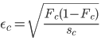
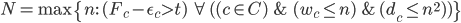

# Getting started
To calculate #AQ, run the Python notebook in [aq-qiskit.ipynb.template](../aq-qiskit.ipynb.template). It will execute the algorithms in the repository that are used to calculate #AQ version 1.0 for a particular hardware backend.

Note that the algorithms used to define #AQ version 1.0 are a subset of all the algorithms present in this repository. Only the Qiskit implementations accessed as specified in `aq-qiskit.ipynb.template` are verified to conform to the rules outlined below.

# Rules For #AQ v1.0
1. This repository defines circuits corresponding to instances of several quantum algorithms. This document outlines the algorithms that must be run to calculate #AQ.

2. The circuits are compiled to a basis of CX, Rx, Ry, and Rz to count the number of CX gates. For #AQ v1.0, the transpiler in Qiskit version 0.34.2 must be used with these basis gates, with the `seed_transpiler` option set to 0, and no other options set.

3. A circuit can be submitted before or after the above compilation to a quantum computer. By quantum computer, here we refer to the entire quantum computing stack including software that turns high-level gates into native gates and software that implements error mitigation or detection. 

4. If the same algorithm instance can be implemented in more than one way using different numbers of ancilla qubits, those must be considered as separate circuits for the purposes of benchmarking. A given version of the repository will specify the implementation and number of qubits for the algorithm instance.

5. If an oracle uses qubits that return to the same state as at the beginning of the computation (such as ancilla qubits), these qubits must be traced out before computing the success metric.

6. Any further optimization is allowed as long as (a) the circuit to be executed on QC implements the same unitary as submitted, and (b) the optimizer does not target any specific benchmark circuit.
 - a. These optimizations may reduce the depth of the circuit that is actually executed. Since benchmarking is ultimately for the whole quantum computing system, this is acceptable. However, the final depth of the executed circuit (the number and description of entangling gate operation) must be explicitly provided.
 - b. Provision (b) will prevent the optimizer from turning on a special purpose module solely for the particular benchmark, thus preventing gaming of the benchmark to a certain extent.

7. Error mitigation techniques like randomized compilation and post-processing have to be reported if they are used. Post-processing techniques may not use knowledge of the output distribution over computational basis states.

8. The success of each circuit run on the quantum computer is measured by the classical fidelity *Fs* defined against the ideal output probability distribution:

where *Pideal* is the ideal output probability distribution expected from the circuit without any errors and *Poutput* is the measured output probability from *sc* runs on the quantum computer, and *x* represents each output result. 

9. The definition of #AQ is as follows:

	- Let the set of circuits in the benchmark suite be denoted by *C*. 
	- Locate each circuit *c ∈ C* as a point on the 2D plot by its 
	  - Width, *wc* = Number of qubits, and
	  - Depth, *dc* = Number of CX gates
	
	- Define success probability for a circuit *c*, *Fc*  
	- The circuit passes if *Fc - ϵc > t*, where *ϵc* is the statistical error based on the number of shots,  where *sc* is the number of runs, and *t = 1/e = 0.37* is the threshold. 
	- Then, define #AQ = N, where 
	

10. The data should be presented as a volumetric plot. The code to plot this is provided in [this repository](../aq-qiskit.ipynb.template).

11. An additional accompanying table should list for each circuit in the benchmark suite the number of qubits, the number of each class of native gates used to execute the circuit, the number of repetitions *sc* of each circuit in order to calculate *Fc*, and *Fc* for each circuit.

## List of algorithms used to define #AQ version 1.0

### Quantum Fourier Transform
- Circuit widths: Any number greater than 2
- Number of circuits per width: 3
- Method Number: 1

### Quantum Phase Estimation
- Circuit widths: Any number greater than 3
- Number of circuits per width: 3

### Amplitude Estimation
- Circuit widths: Any number greater than 3
- Number of circuits per width: 3

### Monte Carlo Sampling
- Circuit widths: Any number greater than 4
- Number of circuits per width: 1
- Method Number: 2

### VQE Simulation
- Circuit widths: Even numbers between 4 to 12
- Number of circuits per width: 3
- Method Number: 1

### Hamiltonian Simulation
- Circuit widths: Even numbers between 2 to 20
- Number of circuits per width: 1

