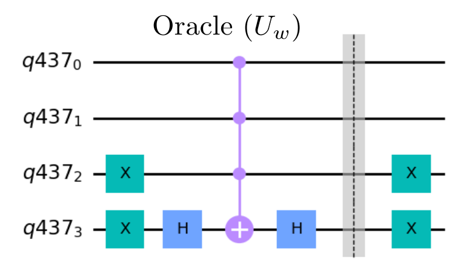
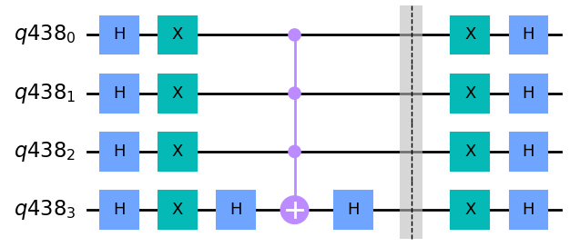
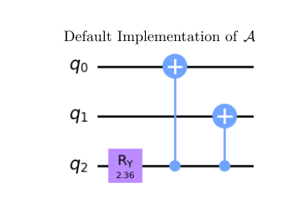

# Quantum Amplitude Estimation - Prototype Benchmark Program

Quantum Amplitude Estimation (QAE) [[1]](#references) is an extremely useful algorithm which provides a quadratic speedup over classical computers for wide classes of problems which would typically be solved by classical Monte Carlo simulations. This algorithm uses two ubiquitous elements of quantum algorithms: Quantum Amplitude Amplification (QAA), described in this README, and [Phase Estimation (PE)](../phase-estimation/). 

## Problem outline

The Quantum Amplitude Estimation Algorithm was first proposed by Brassard et al. as an extension of [Grover's search algorithm](../grovers/). The goal of this algorithm is to estimate a value  given a unitary operation  defined as:

    

Where  are any two states on  qubits, not necessarily orthogonal. In this context, we can think of  as distinguishing between the "bad state"  and "good state"  using the value of an additional qubit. Therefore,  is the probability of measuring a good state from the prepared state . 

## Benchmarking
The Amplitude Estimation algorithm is benchmarked by running `max_circuits` circuits for random  values of the form  where  represents the total number of qubits in register 1 and  is an integer between  and . Each circuit is repeated a number of times denoted by `num_shots`. We then run the algorithm circuit for numbers of qubits between `min_qubits` and `max_qubits`, inclusive. The test returns the averages of the circuit creation times, average execution times, fidelities, and circuit depths, like all of the other algorithms. For this algorithm's fidelity calculation, because we chose  to never require more precision than the qubits in register 1 can provide, we compare the returned measurements against the distribution that has the single state with 100% probability using our [noise-normalized fidelity calculation](../_doc/POLARIZATION_FIDELITY.md).

## Classical algorithm

In order to estimate  using a classical computer, we see we have a quadratic runtime penalty to get the same uncertainty in the measurement. We go more in-depth in the classical process used and the exact scaling in the [Monte Carlo benchmark](../monte-carlo/). This benchmark's README is also where we describe the scaling of the quantum algorithm.

## Quantum algorithm

To find an estimation of , we first use QAA to generate a unitary operator  which encodes  into a phase as . We can do this through calls to our oracle  and its inverse; we do not require knowledge of  to generate . By using PE, we can determine this phase. We then measure out the counting qubits to obtain an integer  and associated 
We finally get an estimation of  by evaluating .

### Quantum Amplitude Amplfication (QAA)

QAA is a process by which the amplitude of good states can be increased, in such a way that only roughly  applications of  is required to achieve a constant probability of measuring the good state for known values of . [Grover's search algorithm](../grovers/) is based on a special case of QAA where  is known to be ,  is a single marked basis state, and  is a uniform superposition of all basis states not including . The visualization provided in the Grover's algorithm README can provide some intuition for the amplification operator. 

The amplification operator in QAE looks quite similar to Grover's algorithm. The idea here is to increase the amplitude of good states by reflecting amplitudes according to the objective qubit state, then performing a reflection about the full original +1 qubit state. In alignment with [[1]](#references), we call a reflection about objective qubit state  the operator  and call a reflection around our initial state  the operator :

It is shown in [[2]](#references) that this has the desired effect of increasing the amplitude of the good states with the following relationship. Using :

This has the amplitude of  increasing for integer  iterations with .

For implementation purposes, it is necessary to define  in terms of oracle access to . Since this is placing a minus sign on all amplitudes of states orthogonal to , it is easier to implement the : placing a minus sign on the original state. In this case, we can implement this operator by transforming from the  basis, which maps  to  perform a reflection on  and return to the  basis. That is:

This is convenient because  can be easily implemented using  and Multi-controlled NOT gates.

So, all together the QAA operator is given as:

With some investigation, we can see the corresponence with Grover's algorithm. This is made more clear in [Gate Implementation](#gate-implementation) section.

### General Quantum Circuit 

*Fig 1. Circuit diagram for QAE using PE as presented by Grinko et al. [[3]](#references)*

### Algorithm Steps

1. Generate  from the amplitude generator . 

2. Use [Phase Estimation](../phase-estimation/) to find the eigenvalue(s) of  with respect to . It is shown in [[1]](#references) that the two eigenstates of  have eigenvalue . While  is not actually an eigenstate of , PE guarentees that the returned bitstring will always correspond to one of the two eigenvalues.

2. Transform eigenvalue estimates into amplitude estimates. At this stage, the bitstrings corresponding to the two phases will lead to an estimator of and therefore . It is clear that both of the eigenvalues will lead to the same value of  due to the even-ness of the squared sine function. It is proven in [[1]](#references) that this follows the variance:
    

    
    

    with probability at least .

## Gate Implementation

To implement this algorithm, all that is necessary is explicit definitions for the operators . Note that we implement the negative sign, originally from , in our implementation of .

 are given to the algorithm as the oracle.  performs a phase flip only if the objective qubit is in the  state. This is equivalent to the operations  on the objective qubit. Lastly, , the phase flip only when all state registers are , is equivalent to performing  on all qubits in the register except the objective qubit, then a multi-controlled-phase gate between the  state qubits and objective qubit, and another set of  gates. Equivalent to multi-controlled-phase is a  on the objective qubit, multi-controlled-NOT, and  again on the objective qubit.

If we then copy the circuits for the oracle and diffuser from Grover's algorithm:

We can see the correspondence that  and . The circuit used for QAA () is simpler than the Grover oracle () as the "correct" state we are marking is only dependent on the objective qubit. The second statement can be explicitely seen by taking  and  to be Hadamards on all qubits. Additionally, we note that while the negative sign in Grover's algorithm didn't matter as it was global, because  is not applied on all qubits, the negative sign matters.

### Default implementation of 

In our default implementation of A, we set  and . To implement arbitrary angles, we use a y-rotation and CNOTs to engtangle all of the states. As an example, with two state qubits and the single "correct-ness" qubit, if we start in the initial state of , after applying an  gate, we will be in the state . By then applying CNOT gates controlled by the last qubits, we entangle the first two qubits with the state of the last: . By remembering that , we have now generated the state we are looking for.  

## References

[1] Brassard, G., Hoyer, P., Mosca, M., & Tapp, A. (2000).
    Quantum Amplitude Amplification and Estimation.
    [`arXiv:quant-ph/0005055`](http://arxiv.org/abs/quant-ph/0005055)

[2] Rao, P., Yu, K., Lim, H., Jin, D., Choi, D.,  (2020).
    Quantum amplitude estimation algorithms on IBM quantum devices.
    [`arXiv:2008.02102`](https://arxiv.org/abs/2008.02102v1)
     
[3] Grinko, D., Gacon, J., Zoufal, C., & Woerner, S. (2019).
    Iterative Quantum Amplitude Estimation.
    [`arXiv:1912.05559`](https://arxiv.org/abs/1912.05559)