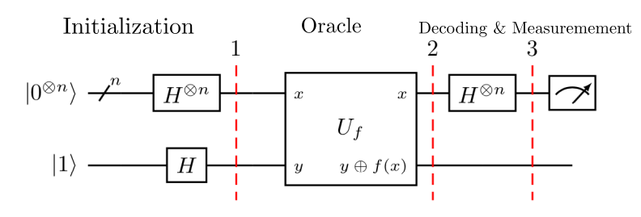
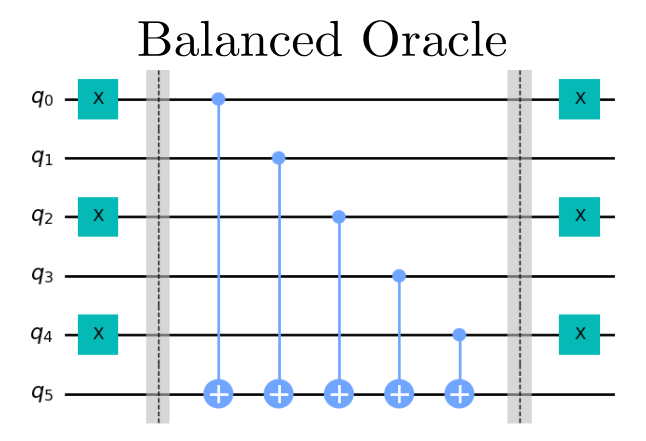

# Deutsch-Josza Benchmarking Test

The Deutsch-Josza Algorithm [[1]](#references) was the first example of a quantum algorithm that 
performs better than any classical algorithm. Despite the problem solved having little practical 
interest, it demonstrates how quantum computers are capable of outperforming classical computers with 
an exponential speedup.

## Problem outline

The goal of the Deutsch-Jozsa Algorithm is to gain information about a specific class of functions.
Suppose we are given access to a black-box Boolean function , 
with the promise that  is either constant or balanced.
A constant function returns either all 0s or 1s, implying  for all .
A balanced function returns 0 for exactly half of all inputs and 1 for the other half. The goal is to determine whether 
the given function is balanced or constant.

## Benchmarking
The Deutsch-Jozsa algorithm is benchmarked by running a max of 2 circuits: both the constant and balanced oracle functions. For the constant oracle, it is randomly chosen if the constant is 0 or 1. The balanced oracle always has the circuit generated the same way for a given number of qubits. Each circuit is repeated a number of times denoted by `num_shots`. We then run the algorithm for numbers of qubits between `min_qubits` and `max_qubits`, inclusive. The test returns the averages of the circuit creation times, average execution times, fidelities, and circuit depths, like all of the other algorithms. For this algorithm's fidelity calculation, as we always have a single correct state, we compare the returned measurements against the distribution that has the single state with 100% probability using our [noise-normalized fidelity calculation](../_doc/POLARIZATION_FIDELITY.md).

The Deutsch-Jozsa algorithm seems to a natural algorithmic benchmark, as it is one of the most simple and well-known algorithms. However, the constant oracle poses a significant problems if the primary noise model is amplitude damping. We will see that this algorithm will always return an all zero state for the constant oracle, which makes it impossible to determine if this state was returned because of correct behavior or because the qubits relaxed to the  all zero state due to noise.

## Classical algorithm
Classically, to solve this problem requires applying  
to a sequence of bitstrings until either two bitstrings  and  
are found such that 
or until  bitstrings have been tested. 
If  is constant, then in the worst case scenario
exactly half of the inputs plus one must be checked to confirm with 100% confidence  is constant.
Thus this classical algorithm takes  time.

## Quantum algorithm
Using a quantum algorithm, the problem can be solved with 100% confidence with only one call to 
implying a runtime of .
This requires  to be implemented as a quantum
oracle. The quantum oracle for the function  
is a unitary operator  that acts on
 data qubits and 1 ancilla qubit such that

,

where  is addition modulo 2.

### General Quantum Circuit
The following circuit is the general quantum circuit for the Deutsch-Jozsa algorithm with  data qubits
and 1 ancilla qubit.

*Fig 1. Diagram of general quantum circuit for Deutsch Algorithm [[2]](#references)*

References [[2]](#references) and [[3]](#references) both have overviews of the mathematical details of the 
algorithm, but the key points will be reproduced here.

### Algorithm Steps

The steps in the Deutsch-Josza algorithm are the following:

1. Initialize two quantum registers where  data qubits are initialized to  for the first register and the 
   one ancilla qubit is initialized to  for the second register.
  
   

   
   

   
2. Apply the Hadamard gate to all  qubits, creating an equal superposition state in the first register and
    in the second register.
   
   

   
   

   
   

   
   

3. Apply the oracle  to the data and ancilla qubits. Recall
    thus
   
   

   
   

   
   

   
   

   
   

   
   

4. Apply the Hadamard gate to all  data qubits in the first register.
   
   

   
   

   
   

   
   

   
5. Measure the data qubits. Note the probability of measuring 
   Thus if the measurement result is the all zero bitstring 00...0, then  is constant. Otherwise, f is balanced.

## Gate Implementation

### Constant Oracle

The constant oracle will either leave the qubits unchanged or apply a single x gate on the data qubit. 

### Balanced Oracle

The balanced oracle applies CNOTs to the ancilla qubit controlled by all the data qubits, with some modification of which input states return 0 and which return 1 with the shifting with the X gates at the start and end of the oracle.

## References

[1] David Deutsch and Richard Jozsa. (1992).
    Rapid Solution of Problems by Quantum Computation
    [`doi.org/10.1098/rspa.1992.0167`](https://royalsocietypublishing.org/doi/10.1098/rspa.1992.0167)

[2] Michael A. Nielsen and Isaac L. Chuang. (2011).
    Quantum Computation and Quantum Information: 10th Anniversary Edition (10th ed.). 
    Cambridge University Press, New York, NY, USA.

[3] Abraham Asfaw, Antonio Córcoles, Luciano Bello, Yael Ben-Haim, Mehdi Bozzo-Rey, Sergey Bravyi, Nicholas Bronn, Lauren Capelluto, Almudena Carrera Vazquez, Jack Ceroni, Richard Chen, Albert Frisch, Jay Gambetta, Shelly Garion, Leron Gil, Salvador De La Puente Gonzalez, Francis Harkins, Takashi Imamichi, Hwajung Kang, Amir h. Karamlou, Robert Loredo, David McKay, Antonio Mezzacapo, Zlatko Minev, Ramis Movassagh, Giacomo Nannicini, Paul Nation, Anna Phan, Marco Pistoia, Arthur Rattew, Joachim Schaefer, Javad Shabani, John Smolin, John Stenger, Kristan Temme, Madeleine Tod, Stephen Wood, and James Wootton. (2020).
    [`Deutsch-Jozsa Algorithm`](https://qiskit.org/textbook/ch-algorithms/deutsch-jozsa.html)