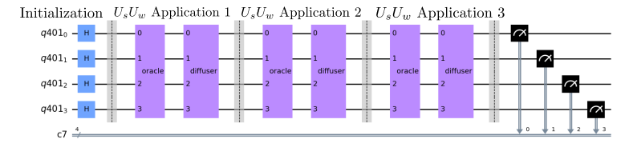

# Grover's Algorithm - Prototype Benchmark Program

Grover's algorithm [[1]](#references), also referred to as the quantum search algorithm, is one of the most well known quantum algorithms due to its large amount of applications as well as its quadratic runtime speedup from any known classical algorithm. It is a special case of the more general [Amplitude Estimation](../amplitude-estimation/) algorithm.

## Problem outline
This algorithm solves unstructured search problems, such as where we have a large, un-ordered list of items and have some "correct" item(s) we are looking for. We can check if each item is correct through an *oracle*, where for Grover's algorithm, the oracle gives the correct state a negative phase to distinguish it from other states. The methods we will describe here work for an arbitrary number of correct items, but in this benchmark we only have a single correct item we are looking for.

## Benchmarking
Grover's algorithm is benchmarked by running `max_circuits` circuits for different correct items `s_int`, chosen uniformly at random from  for  qubits. Each circuit is repeated a number of times denoted by `num_shots`. We then run the algorithm circuit for numbers of qubits between `min_qubits` and `max_qubits`, inclusive. The test returns the averages of the circuit creation times, average execution times, fidelities, and circuit depths, like all of the other algorithms. For this algorithm's fidelity calculation, the algorithm can return a distribution when the number of qubits is small, so we compare against the analytical expected distribution using our [noise-normalized fidelity calculation](../_doc/POLARIZATION_FIDELITY.md).

## Classical Algorithm
For a classical algorithm, the only way to solve the problem is to test each potential solution one at a time. For a list of  items (and a single solution), this would take  steps on average, and  steps in the worst case scenario. 

## Quantum Algorithm
However, for this quantum algorithm, we see that it will take us  rotations to reach a high likelihood of success. Reference [[2]](#references) has an excellent overview of the algorithm, but we will also reproduce the key points for the algorithm here.

The primary intuition behind this algorithm can come from the geometric picture of sequentially applying reflections across the incorrect solutions and across the uniform superposition state. 

---

This image and the following two come from [[2]](#references). We initially start in a uniform superposition of all  states,

,

where  is the correct solution and  contains the rest of the states in . Note: in this explanation,  is the total number of states, not the total number of qubits. For example, for 3 qubits, we would have  items. By doing some math with these definitions, we can see that . 

---

We then apply the oracle, which by defintion will add a phase of  to the state , which is stated as a unitary operator as . This definition does what we expect, as any state that is orthogonal to  will only have the identity operator applied to it, while the state  itself will have a non-zero result from both terms, leading to . Geometrically, this is a reflection around . 

---

We will then apply , which will give a reflection across . (Note: we will actually apply , but there is no difference as this negative sign is a global phase which is unobservable). We can then successively apply  to bring the solution as close to  as possible. By using the definitions of these operators and some matrix manipulation, we see that  for  applications of the oracle and diffuser. From this, we can see that the probability of measuring  is maximized when , which will only take  applications of these operators. This is much better than the  applications with the classical algorithm!

### General Quantum Circuit

Circuit diagram for Grover's algorithm with 4 qubits.

### Algorithm Steps

The steps for Grover's algorithm are the following:

1. Initialize all the qubits to .
   
   

   
   

   
2. Hadamard all qubits to create an equal superposition state.
   
   

   
   

   
   

   
   

   
3. Apply the two oracle and diffuser operators  times.
   
   

   
   

   

   
   

   
4. Measure qubits and the solution string  will appear with high likelihood, assuming an error-free quantum computer

## Gate Implementation

### Grover Oracle 

The following is the quantum circuit for the Grover oracle for 4 qubits with . The oracle applies a phase just to this correct state. Note that the barrier is solely for better visualization. To create this oracle, we start by applying  gates on just the qubits which are not  in the solution . This ensures that the correct bitstring goes to the state . We then apply a multi- on all qubits to add a phase of  to only . We then apply the same  gates to make sure that only  has aquired the relative phase of .

### Grover Diffuser 

The following is the quantum circuit for the Diffuser for 4 qubits. As implemented, this will only provide a phase to the state . Note that the barrier is solely for better visualization. We start by applying a Hadamard gate all qubits to take . We then add a phase of  to only  by applying  gates on every qubit, applying a multi-, and applying the  gates again. We finally Hadamard all qubits again to take .

---

## References

[1] Lov K. Grover. (1996)
   A fast quantum mechanical algorithm for database search.
    [`arXiv:quant-ph/9605043`](https://arxiv.org/abs/quant-ph/9605043v3)

[2] Abraham Asfaw, Antonio Córcoles, Luciano Bello, Yael Ben-Haim, Mehdi Bozzo-Rey, Sergey Bravyi, Nicholas Bronn, Lauren Capelluto, Almudena Carrera Vazquez, Jack Ceroni, Richard Chen, Albert Frisch, Jay Gambetta, Shelly Garion, Leron Gil, Salvador De La Puente Gonzalez, Francis Harkins, Takashi Imamichi, Hwajung Kang, Amir h. Karamlou, Robert Loredo, David McKay, Antonio Mezzacapo, Zlatko Minev, Ramis Movassagh, Giacomo Nannicini, Paul Nation, Anna Phan, Marco Pistoia, Arthur Rattew, Joachim Schaefer, Javad Shabani, John Smolin, John Stenger, Kristan Temme, Madeleine Tod, Stephen Wood, and James Wootton. (2020).
    [`Grover's Algorithm`](https://qiskit.org/textbook/ch-algorithms/grover.html)

[//]: # (Link to location which has the entire qiskit-textbook bibtex file: https://github.com/qiskit-community/qiskit-textbook/blob/main/content/qiskit-textbook.bib)

[3] Michael A. Nielsen and Isaac L. Chuang. (2011).
    Quantum Computation and Quantum Information: 10th Anniversary Edition (10th ed.). 
    Cambridge University Press, New York, NY, USA.