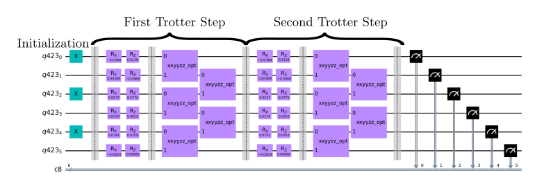
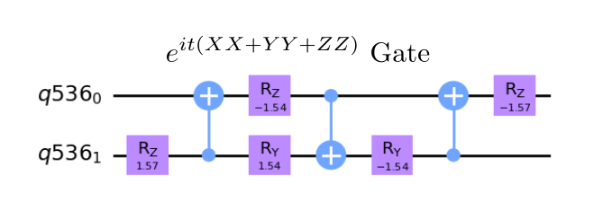

# Hamiltonian Simulation - Prototype Benchmark Program

Simulation of quantum systems is one of the most promising applications for quantum computers [[1]](#references). In the current version of this benchmark, we compare the quantum simulation against a classical simultion of the same circuit in order to report our fidelity. This works well for small circuit sizes, but is not scalable past a certain number of qubits. Additionally, we can now only run specific circuits, rather than random ones, limiting the ability of this benchmark to completely characterize real uses cases of the Hamiltonian simulation algorithm. We have some suggested modifications to this benchmark which we outline and explain why we did not chose to use them at this time in the section [Proposed Improvements](#Proposed-Improvements).

## Problem outline

This benchmark is written as a simulation of non-trivial Hamiltonians. It is constrained to model a linear chain of interacting bodies with an open boundary condition. Our Hamiltonians of interest are the **Heisenberg model with disordered fields** and the **Transverse Field Ising Model (TFIM)**, both with open boundary conditions.

**For the Heisenberg Hamiltonian**, we start the system in an easily preparable classical state $|\psi(0)\rangle\equiv|010101\ldots\rangle$. **For the Transverse Field Ising Model (TFIM)**, we start the system in a GHZ state  $|\psi(0)\rangle = \left| \text{GHZ} \right\rangle = \frac{1}{\sqrt{2}} \left( |0\rangle^{\otimes n} + |1\rangle^{\otimes n} \right)$, where $n$ is equivalently the number of spins or qubits. In either case, we aim to evolve the system for $t$ time according to the solution to the Schrödinger equation with $H$ constant,

$$
|\psi(t)\rangle=e^{-i{H}t}|\psi(0)\rangle
$$

where we set  here and elsewhere.

### Heisenberg Model

Where  is the strength of the interaction,  is the strength of the disordered fields,  and  give the strength of the x and z disorded fields at site , and  are the usual Pauli operators acting on site . We will use the notation  interchangably throughout this explanation.

The first sum represents the **interaction terms**, wheras the second sum represents the **disordered field terms** (see Fig 1.)

In our benchmarks, currently both $J=1$ and $w=1$.

### Transverse Field Ising Model (TFIM)

The TFIM Hamiltonian is given by:

$$
H= J\sum_{i=0}^{N-2}\sigma^z_i\sigma^z_{i+1} + h\sum_{i=0}^{N-1}\sigma^x_i
$$

Where  is the coupling strength between neighboring spins, and  is the strength of the transverse field.

In our benchmarks, currently both $J=1$ and $h=.2$.

## Benchmarking
The Hamiltonian Simulation algorithm is benchmarked by running **just a single circuit**. This circuit is repeated a number of times denoted by `num_shots`. We then run the algorithm circuit for numbers of qubits between `min_qubits` and `max_qubits`, inclusive. The test returns the averages of the circuit creation times, average execution times, fidelities, and circuit depths, like all of the other algorithms. 

After running the Hamiltonian Simulation circuit, there are two options for how to produce the fidelity metric, both of which use a precalculated distribution to compare to the Hamiltonian Simulation results. Method = 1 uses a distribution from a noiseless simulation of the trotterized quantum circuit. For this method, if the benchmark is also run on a noiseless simulation, with a high number of shots, the fidelity should be high. Method = 2 uses a classical matrix technique to simulate the evolution of the hamiltonian directly. Wheras method = 1 more directly tests the hardware, method = 2 also tests the accuracy of the hamiltonian simulation algorithm itself. 

In either case, we compare the resultant distribution using our [noise-normalized fidelity calculation](../_doc/POLARIZATION_FIDELITY.md).

We calculate these expected distributions in the jupyter notebook `precalculated_data.ipynb`, which stores the results for up to 20 qubits in the `precalculated_data.json` data file. The python code then imports the distributions from the `json` file. This is a less than ideal fidelity calculation as it does not scale to any size of qubits. It requires the classical simulation of matrix products, which requires resources exponential in number of qubits. 

In the `precalculated_data.ipnyb`, we set the trotterization steps (k) to 5 and the time to .2. For the Heisenberg Hamiltonian, $w$ is set to 1 but $J$ is hard-coded to 1. For TFIM, the Hamiltonian variables are both hard-coded to $J=1$ and $h=.2$ respectively. 

## Classical algorithm

Much effort has been done in the field of many-body physics to understand the approximate behaviors of Hamiltonians like the ones we have here. However, to calculate the evolution of an excited state through exact diagonalization scales approximately as  for  qubits, quite poor scaling [[2]](#references). This quickly becomes intractible even utilizing extremely powerful classical supercomputers.

## Quantum algorithm

To run this algorithm on our quantum computer, we need to find a way to apply the unitary  through a combination of quantum gates. In order to approximate this operator, we use Trotterization [[3]](#references), where we note that Lie product formula gives

.

If we take  to be finite, this is called Trotterization. This has a gate complexity of , which is an exponential speedup. We can then apply successive layers of by exponentiating the individual terms in the Hamiltonian to approximate the evolution of any state. This makes the simulation easier, as it is much easier to calculate the gates which apply  and  than to find the gates which apply . This process can be visualized in the circuit diagram below for the **Heisenberg Hamiltonian** with a single step.

### General Quantum Circuit

*Fig 1. Example of circuit with 1 Trotter step. We can see that our  and  turned into Rx and Ry gates, while the two qubit interactions turned into the gates that result from exponentiating these terms in the Hamiltonian. Note that this circuit application is less efficient than applying the XX, YY, and ZZ operations all at once.*

*Fig 2. Circuit with 2 Trotter steps and the optimal XXYYZZ operator.*

### Algorithm Steps

1. Initialize qubits in alternating state .

2. Build the Trotter step layer.

3. Apply the Trotter step layer for as many Trotter steps were chosen.

4. Measure out all of the qubits

## Gate Implementation

There are two options of circuit creation for this simulation:

- **Default:** Optimal implementation of , used as the default. See [[4]](#references) for reasoning for why this is the optimal application of gates.

- **use_XX_YY_ZZ_gates:** Simple implementation of , , and , provided for reference purposes and validation of the optimal implementation. In essence, we initially generate  using two CNOT gates and an RZ gate. We then apply the XX and YY versions of this gate by providing a basis change from Z to X and from Z to Y, using Hadamard gates for the X transformation and using S and Hadamard gates for the Y transformation respectively. These circuits are below. It is possible to use this type of gates by passing `use_XX_YY_ZZ_gates=True` to the `run()` function.

*Fig 3. Optimal gate which applies .*

---

*Fig 4. Naive  gate.*

---

*Fig 5. Naive  gate.*

---

*Fig 6. Naive  gate.*

## Proposed Improvements

Our suggested method of modifying this benchmark involves a topic taken from condensed matter called *many-body localization* [[2]](#references) [[5]](#references). The essence of this phenomenon is that for certain closed quantum systems, some excited states fail to thermalize as expected. 

The parameters that we use for the current Hamiltonian simulation benchmark already put us in the many-body localization regime. After evolving the system for a suitibly long time, with , we can then take a look at a parameter called *imbalance* to characterize this property. The imbalance compares the percentage of measured 1's on the even versus odd sites. We see that for our Heisenberg Hamiltonian, when averaging over many random choices for  and , the imbalance will converge to a constant value for increasing circuit width. We could then set our fidelity calculation as the deviation from the expected imbalance value. This benchmark is outlined in the `mbl_benchmark.py` file in the qiskit `WIP_benchmarks` folder.

While we have already coded this benchmark, we are not using it as a benchmark because some of the parameters required are not feasible on current computers. Because of our comparatively large value of , we need to have a large number of Trotter steps  so our simulation is close to the actual evolution of the Hamiltonian. This results in circuits that are thousands of gates long. Then, because the imbalance converging is a feature that occurs *on average*, we need to average over more than 100 different circuits for the fidelity calculation to capture just the hardware error, not the algorithmic error. All of these factors make it such that running the benchmark is difficult on simulators, and exceedingly expensive and/or time-intensive to run on hardware. In the future, when hardware is more accessible, these downsides might not be as big of an issue, and many-body-localization can be utilized as an effective benchmark.
 
## References

[1] Feynman, RP. (1982) Simulating physics with computers. Int J Theor Phys 21:467–488.

[2] Andrew M. Childs, Dmitri Maslov, Yunseong Nam, Neil J. Ross, Yuan Su. (2017).
    Toward the first quantum simulation with quantum speedup.
    [`arXiv:1711.10980`](https://arxiv.org/pdf/1711.10980.pdf)

[3] Naomichi Hatano, Masuo Suzuki. (2005).
    Finding Exponential Product Formulas of Higher Orders
    [`arXiv:math-ph/0506007`](https://arxiv.org/abs/math-ph/0506007v1)

[4] Farrokh Vatan, Colin Williams. (2004).
    Optimal Quantum Circuits for General Two-Qubit Gates.
    [`arXiv:quant-ph/0308006`](https://arxiv.org/abs/quant-ph/0308006)

[5] D. Zhu, S. Johri, N. H. Nguyen, C. Huerta Alderete, K. A. Landsman, N. M. Linke, C. Monroe, A. Y. Matsuura. (2021).
    Probing many-body localization on a noisy quantum computer.
    [`arXiv:2006.12355`](https://arxiv.org/abs/2006.12355)

[//]: # (Below are some thoughts that went into the choice of the type of hamiltonian simulation to be used for this benchmark.)

[//]: # (Nearest-neighbor 1D, 2D and 3D cases are all physically motivated, corresponding to say, a nanowire, a thin film, and a cubic crystal. In this case, 1D is a suitable benchmark for current quantum computers since it has the least number of gates. As quantum computers improve, the simulation benchmarks could be designed to include higher dimensions.)

[//]: # (If interactions between all pairs of spins were to be added, it would correspond to a limit of the long-range Heisenberg model. There are studies on this, but it may not show the localization behavior being captured in the accuracy metric in the benchmark. For this reason, the benchmark was written for the 1D case only.)

[//]: # (The bodies being simulated can be represented as a linear chain of bodies, i.e. a 'open boundary condition' or in a circle, i.e. a 'periodic boundary condition'. In the limit of large system size, the boundary will not affect the bulk physics represented here. For small system sizes, periodic boundaries have some advantage in that they are less susceptible to 'edge effects', and the system can be Fourier transformed and studied in momentum space. Their drawback is that some numerical approximation techniques work poorly. In other simulation studies such as those of topological phenomena, there is important physics corresponding to a 'bulk-boundary correspondence', and the open edge is purposefully introduced.)

[//]: # (Therefore, the choice of boundary condition depends on the system being studied and the computational technique being employed. Here it does not matter too much.)
