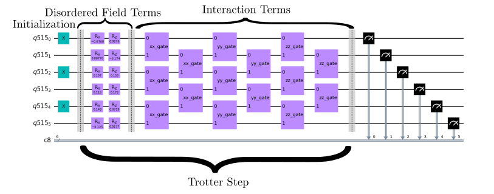
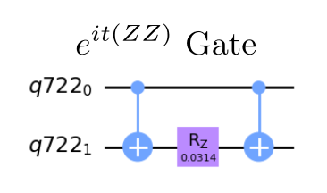
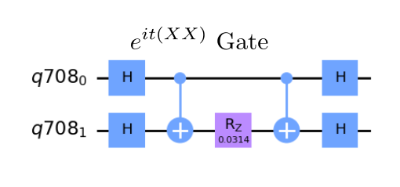
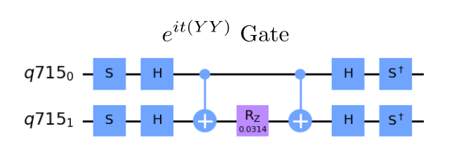

# HamLib Simulation - Benchmark Program

Simulation of quantum systems is one of the most promising applications for quantum computers [[1]](#references). In the current version of this benchmark, we have three strategies for calculating the fidelity of a quantum Trotterization circuit. 

In the first strategy, we compare the trotter circuit results on target hardware against a classical circuit simulation to report our fidelity. This works well for small circuit sizes but is not scalable past a certain number of qubits. 

In the second strategy, we compare the trotter circuit results against a classical simulation of the exact Hamiltonian dynamics to report our fidelity. Again, this is not scalable.

In the third strategy, we use the mirror circuits method developed by Sandia Laboratories [[2]](#references). This technique constructs a mirror circuit, which is a base circuit followed by a reverse circuit. It produces an easy to verify correct distribution that still reflects the effectiveness of the original circuit. This is scalable to all qubit sizes. 

This benchmark is a more advanced version of the existing Hamiltonian Simulation Benchmark. It offers the user several Hamiltonians to simulate from Hamlib [[3]](#references), a comprehensive dataset of qubit-based Hamiltonians. It also offers a more complete version of the mirror circuits method that offers techniques such as implementing a random Pauli layer and random initial state to reduce unintentional error effects from the circuit mirroring.  

## Problem outline

This benchmark is written as a simulation of non-trivial Hamiltonians from Hamlib. It currently supports the following Hamiltonians: The Fermi-Hubbard Model, the Bose-Hubbard Model, the Heisenberg Model, the Transverse Field Ising Model, and the Max3Sat problem. The first four problems have only been implemented in their 1D cases. However, the benchmark can be easily generalized to benchmark any of the other Hamiltonians classes from Hamlib. 

The benchmark evolves an initial state according to a Hamiltonian $H$. The benchmark has two possible initial states, the checkerboard state $|\psi(0)\rangle\equiv|010101\ldots\rangle$ or the GHZ state  $|\psi(0)\rangle = \left| \text{GHZ} \right\rangle = \frac{1}{\sqrt{2}} \left( |0\rangle^{\otimes n} + |1\rangle^{\otimes n} \right)$, where $n$ is equivalently the number of spins or qubits. In either case, we aim to evolve the system for $t$ time according to the solution to the Schrödinger equation with $H$ constant,

$$
|\psi(t)\rangle=e^{-i{H}t}|\psi(0)\rangle
$$

where we set  here and elsewhere.

**The following Hamiltonians are currently supported. See the Benchmarking section below to see how to select them. For the physical models, only the 1D cases have been implemented thus far.** 

### Fermi-Hubbard Model

The Fermi-Hubbard Hamiltonian models the dynamics of fermions on lattice sites and is given by

$$
H_{FH} = -t \sum_{\langle i, j \rangle, \sigma} (c_{i,\sigma}^\dagger c_{j,\sigma} + c_{j,\sigma}^\dagger c_{i,\sigma}) + U \sum_i n_{i,\uparrow} n_{i,\downarrow},
$$

where $\langle i, j \rangle$ denotes adjacent lattice sites $i$ and $j$, $\sigma$ represents the fermion spin, $c$ and $c^\dagger$ are the fermionic annihilation and creation operators, respectively, and $n_{j,\sigma} = c_{j,\sigma}^\dagger c_{j,\sigma}$ is the number operator. The first term of the Hamiltonian describes the tunneling of fermions between adjacent sites with amplitude $t$, representing the noninteracting dynamics, while the second term captures the on-site fermion interaction with strength $U$.

For our benchmarks, we only use the 1D Fermi-Hubbard model but allow varying $U$ and $t$.

### Bose-Hubbard Model

The Bose-Hubbard model is expressed as

$$
H_{BH} = -t \sum_i (b_i^\dagger b_{i+1} + b_{i+1}^\dagger b_i) + \frac{U}{2} \sum_i n_i(n_i - 1),
$$

where $b_i^\dagger$ and $b_i$ denote the creation and annihilation operators respectively, $n_i = b_i^\dagger b_i$ represents the number operator at site $i$, $t$ is the tunneling strength (assumed to be $t = 1$ in this dataset), and $U$ is the interaction energy per site.

### Heisenberg Model

We implement the following Hamiltonian for the quantum Heisenberg model:

$$
H_{\text{Heis}} = \sum_{i=1}^{N} (\vec{\sigma}_i \cdot \vec{\sigma}\_{i+1} + h Z_i).
$$

where $\vec{\sigma}_i = (X_i, Y_i, Z_i)$. This Hamiltonian, known as the Heisenberg XXX model, incorporates an external magnetic field represented by $h$, where $h$ modulates the strength of the magnetic field interaction along the Z-axis of each spin.

### Transverse Field Ising Model (TFIM)

The Hamiltonian for this model is expressed as

$$
H = \sum_i h_i X_i + \sum_{\langle i, j \rangle} Z_i Z_j,
$$

where the summation extends over each edge $\langle i, j \rangle$ within the lattice.

### Max3Sat Problem

To represent a 3-SAT problem in quantum computing, one constructs a Hamiltonian by summing terms involving three variables. If no negations are included, the Hamiltonian for a clause $(x_i \lor x_j \lor x_k)$ is represented as:

$$
x_i \lor x_j \lor x_k = I - \frac{1}{8} (I + Z_i)(I + Z_j)(I + Z_k),
$$

where $I$ is the identity matrix and $Z$ denotes the Pauli-Z operator, reflecting the influence of each variable in the clause.

## Benchmarking
The Hamlib Simulation algorithm is benchmarked, in most cases, by running **just a single circuit (see Mirror Method Circuit Section for the exception.**) This circuit is repeated a number of times denoted by `num_shots`. We then run the algorithm circuit for numbers of qubits between `min_qubits` and `max_qubits`, inclusive. The test returns the averages of the circuit creation times, average execution times, fidelities, and circuit depths, like all of the other algorithms. 

There are currently three methods for how to produce the fidelity metric. All three methods evolve a state and create a metric based on how well the state evolved. 

In all three methods, by default, we set the trotterization steps (k) to 5 and the total time to 1, but these can be set to different values at the user's discretion.  

The first two methods evolve an initial state a time $t$ and compare the final state against a correct distribution. Method = 1 creates the correct distribution from a noiseless simulation of the Hamiltonian Simulation quantum circuit. Method = 2 creates a correct distribution from a classical matrix technique to simulate the evolution of the Hamiltonian directly. Whereas method = 1 only tests the performance of the hardware, method = 2 also tests the accuracy of the Hamiltonian simulation itself. 

These correct distributions are created on-the-fly as the benchmarks are run. (This is unlike the Hamiltonian Simulation Benchmark, which uses precalculated distributions.) This is a less than ideal fidelity calculation as it does not scale to any size of qubits. It requires the classical simulation of matrix products, which requires resources exponential in the number of qubits. 

Method = 3 uses a mirror circuit built using the Hamiltonian Simulation circuit, designed so that the correct distribution is trivial. It applies first the circuit, then the reverse of the circuit, so that the final state should be the (trivial) initial state. There are additional options to use a layer of random Paulis in the middle and/or a random initial state to increase generality and resistance to unintentional error effects from the structure of mirroring. **See the Mirror Circuit section below for more details.** This method scales to any size of qubits, since the correct distribution is easy to calculate.  

In all cases, we compare the resultant distribution using our [noise-normalized fidelity calculation](../_doc/POLARIZATION_FIDELITY.md).

In the run() method for the benchmark, several optional arguments can be specified. Some of the key parameters are as follows: 
```
Parameters 
---- 
min_qubits (int): Minimum number of qubits for the simulation. 
                  The smallest circuit is 2 qubits.
max_qubits (int): Maximum number of qubits for the simulation.
max_circuits (int): Maximum number of circuits to execute per group.
skip_qubits (int): Increment of number of qubits between simulations.
num_shots (int): Number of measurement shots for each circuit execution.
hamiltonian (str): The type of Hamiltonian to simulate. Default is "tfim".
                    Options include:
                    - "tfim": Transverse Field Ising Model.
                    - "heis": Heisenberg model.
                    - "random_max3sat-hams": Random Max 3-SAT Hamiltonians for binary optimization problems.
                    - "FH_D-1": Fermi-Hubbard model in 1D
                    - "BH_D-1_d-4": Bose-Hubbard model in 1D
method (int): Method for fidelity checking. 
              Options include:
              - 1: Noiseless Trotterized Quantum Simulation.
              - 2: Exact Classical Simulation.
              - 3: Mirror Circuit Simulation using Sandia Labs' method.
random_pauli_flag (bool): If True and method is 3, activates random Pauli gates in the circuit.
random_init_flag (bool): If True, initializes random quantum states. 
                          Only active if random_pauli_flag is True and method is 3.
use_inverse_flag (bool): If True, uses the inverse of the quantum circuit rather than the original circuit.
do_sqrt_fidelity (bool): If True, computes the square root of the fidelity for measurement results.
init_state (str): Specifies the initial state for the quantum circuit. 
                  If None, a default state is used.
K (int): Number of Trotter steps for the simulation. 
          This is a crucial parameter for the precision of the Trotterized simulation.
t (float): Total simulation time. This parameter is used to determine the evolution time for the Hamiltonian.
```
You can run the code by passing various arguments to execute a desired Hamiltonian with a specific method in either a noisy or noiseless model. Below are some key arguments available for this benchmark:

| Parameters              | Arguments  | Description                                                                 | Default Value |
|-------------------------|------------|-----------------------------------------------------------------------------|---------------|
| `--num_shots`           | `-s`       | Number of measurement shots for each circuit execution                      | `100`         |
| `--num_qubits`          | `-n`       | Number of qubits (sets both min and max qubits to the same value)           | `0`           |
| `--min_qubits`          | `-min`     | Minimum number of qubits for the simulation                                 | `3`           |
| `--max_qubits`          | `-max`     | Maximum number of qubits for the simulation                                 | `8`           |
| `--max_circuits`        | `-c`       | Maximum number of circuit repetitions                                       | `1`           |
| `--method`              | `-m`       | Algorithm Method (1 for noiseless, 2 for classical, 3 for mirror circuit)   | `1`           |
| `--nonoise`             | `-non`     | Use Noiseless Simulator (enables a noiseless model for the simulation)      | `False`       |
| `--time`                | `-time`    | Total time of evolution for the Hamiltonian simulation                      | `1`           |
| `--num_steps`           | `-steps`   | Number of Trotter steps for the simulation                                  | `5`           |
| `--random_pauli_flag`   | `-ranp`    | Generate random Pauli gates in the circuit                                  | `False`       |
| `--random_init_flag`    | `-rani`    | Generate random initial states for the simulation                           | `False`       |
| `--init_state`          | `-init`    | Initial state for the quantum circuit (e.g., GHZ, Checkerboard)             | `None`        |

Example Command

Here’s how you can run the script with specific parameters:

```
python hamlib_simulation_benchmark.py -n 5 -init ghz -m 3 -ranp -non
```

Explanation:
```
    -n 5: Specifies the use of 5 qubits for the simulation (sets both min_qubits and max_qubits to 5).
    -init ghz: Sets the initial state to GHZ.
    -m 3: Applies Method 3, which involves using mirror circuits.
    -ranp: Activates random Pauli gates in the circuit.
    -non: Runs the simulation in a noiseless model.
```

## Classical algorithm

Much effort has been made in the field of many-body physics to understand the approximate behaviors of Hamiltonians like the ones we have here. However, to calculate the evolution of an excited state through exact diagonalization scales approximately as  for  qubits, quite poor scaling [[4]](#references). This quickly becomes intractable even utilizing extremely powerful classical supercomputers.

## Quantum algorithm

To run this algorithm on our quantum computer, we need to find a way to apply the unitary  through a combination of quantum gates. In order to approximate this operator, we use Trotterization [[5]](#references), where we note that Lie product formula gives

<p align="center">
.
</p>

If we take  to be finite, this is called Trotterization. This has a gate complexity of , which is an exponential speedup. We can then apply successive layers by exponentiating the individual terms in the Hamiltonian to approximate the evolution of any state. This makes the simulation easier, as it is much easier to calculate the gates which apply  and  than to find the gates which apply . This process can be visualized in the circuit diagram below for the **Heisenberg Hamiltonian** with a single step.

### General Quantum Circuit

<p align="center">

</p>

*Fig 1. Example of circuit with 1 Trotter step. We can see that our  and  turned into Rx and Ry gates, while the two qubit interactions turned into the gates that result from exponentiating these terms in the Hamiltonian. Note that this circuit application is less efficient than applying the XX, YY, and ZZ operations all at once.*

### Algorithm Steps

1. Initialize qubits in either Checkerboard or GHZ state.

2. Build the Trotter step layer.
   
3. Apply the Hamiltonian as Trotter step layers for as many Trotter steps were chosen.

4. Check if method == 3. If True, apply mirror circuit.

5. Measure out all of the qubits

6. Compare the measured distribution with the distribution from specific methods.

7. Get the metrics like fidelity, circuit depth, time of execution, etc.

## Gate Implementation

Circuit creation is handled by `qiskit_algorithms`. Simple implementation of the Pauli exponential gates used are shown below.

---

<p align="center">

</p>

*Fig 4. Naive  gate.*

---

<p align="center">

</p>

*Fig 5. Naive  gate.*

---

<p align="center">

</p>

*Fig 6. Naive  gate.*


## Mirror Circuit Method:

The primary goal of implementing the mirror circuit methods is to create accurate and scalable benchmarks for the Hamiltonian Simulation circuits. There are several options for how the mirror circuits are constructed. By default, a mirror circuit consists of an initial state, the Trotterized Hamiltonian simulation circuit, and then the inverse of the Trotterized circuit. In this case, the correct distribution is simply the starting state.

The first option to consider is to apply a randomized Pauli layer in the center of the circuit. This layer is designed to lessen error propagation between the two halves of the circuit, improving the accuracy of the simulation since we are only interested in the error profile of half a mirror circuit. To most effectively utilize the randomized Pauli layer, set `max_circuits` > 1 to average over several random Pauli circuits, where each random Pauli circuit is run `num_shots` times. The reported metrics will be an average across all the random circuits results. 

There is also the option to use a random initial state, which replaces the currently set initial state with a (Harr) random one. This allows for testing the circuit's performance under varied initial conditions, which may provide a more comprehensive evaluation of the simulation circuit. 


## References

[1] Feynman, RP. (1982) Simulating physics with computers. Int J Theor Phys 21:467–488.

[2] Proctor, T., Rudinger, K., Young, K. et al. Measuring the capabilities of quantum computers. Nat. Phys. 18, 75–79 (2022). https://doi.org/10.1038/s41567-021-01409-7 

[3] Sawaya, N. P., Marti-Dafcik, D., Ho, Y., Tabor, D. P., Neira, D. E. B., Magann, A. B., ... & Camps, D. (2023, September). 
    HamLib: A library of Hamiltonians for benchmarking quantum algorithms and hardware. 
    In 2023 IEEE International Conference on Quantum Computing and Engineering (QCE) (Vol. 2, pp. 389-390). IEEE.

[4] Andrew M. Childs, Dmitri Maslov, Yunseong Nam, Neil J. Ross, Yuan Su. (2017).
    Toward the first quantum simulation with quantum speedup.
    [`arXiv:1711.10980`](https://arxiv.org/pdf/1711.10980.pdf)

[5] Naomichi Hatano, Masuo Suzuki. (2005).
    Finding Exponential Product Formulas of Higher Orders
    [`arXiv:math-ph/0506007`](https://arxiv.org/abs/math-ph/0506007v1)
