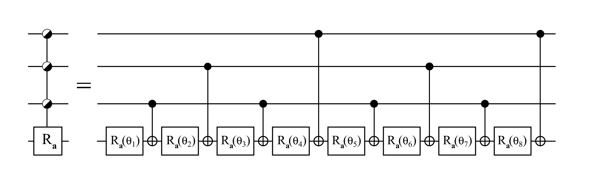

# HHL Algorithm - Linear Equation Solver

The HHL (HHL) quantum algorithm [[1]](#references) may demonstrate a quantum speedup over its classical counterpart for solving linear equations. 

The HHL offers a more complex algorithm that uses a combination of Quantum Phase Estimation and Quantum Fourier Transform along with state initialization and a new and unique, scalable, inverse rotation algorithm. The combination of the component routines taken together provides an extension to the benchmark suite that fills a gap between the QFT and Amplitude Estimation algorithms.

This is also a benchmark that can measure fidelity of circuit execution, but can also provide an application specific metric based on how well the algorithm solves the linear equation.

NOTE: The remainder of this README needs to be modifed with content for HHL.

## Problem outline

Insert HHL picture here. 

Given the linear equation , where A is a N_b x N_b matrix. In the quantum circuit that will be performed  where n_b will be the number of qubits in the circuit. The restrictions on A is that it has to be an s-sparse Hermitian matrix, meaning that A has at most s elements in each row/column.

## Benchmarking
The HHL benchmark is available in the hhl folder in the master repo. It has a file to build the Hamiltonian Simulation circuit, a file to create the uniformally controlled rotational, and a file to execute the entire algorithm. To evalute the solution, the HHL algorithm is compared to the classical solution to the Ax=b, and the fidelity is computed. 
The HHL algorithm is benchmarked by running a sample sparse A matrix with a scalable number of qubits.Each circuit is repeated a number of times denoted by `num_shots`. We then run the algorithm for numbers of qubits between `min_qubits` and `max_qubits`, inclusive. The test returns the averages of the circuit creation times, average execution times, fidelities, and circuit depths, like all of the other algorithms. For this algorithm's fidelity calculation, as we always have a single correct state, we compare the returned measurements against the distribution that has the single state with 100% probability using our [noise-normalized fidelity calculation](../_doc/POLARIZATION_FIDELITY.md).

## Classical algorithm
Classically, linear equations can be solved a variety of ways, mainly taking the inverse of the matrix or applying Guassian Elimination. A refesher of Guassian Elimination can be found here: https://en.wikipedia.org/wiki/Gaussian_elimination. However methods like Guassian Elimination can take  time.

## Quantum algorithm

The HHL algorithm has five main components, namely state preparation, Quantum Phase Estimation, Controlled RY Rotation for the ancilla qubit, Inverse Quantum Phase Estimation, and measurement.

The state starts with the initial state,  and the final state 

### General Quantum Circuit
The following circuit is the general quantum circuit for the HHL algorithm with  b-register qubits,  c-register(clock) qubits and 1 ancilla qubit. 

   

*Fig 1. Diagram of general quantum circuit for Bernstein-Vazirani Algorithm [[2]](#references)*

References [[2]](#references) and [[3]](#references) both have overviews of the mathematical details of the 
algorithm, but the key points will be reproduced here.

### Algorithm Steps

The steps for the HHL algorithm are the following, with the state after each step, :

1. Initialize two quantum registers and the ancilla qubit. The b-register register has  data qubits initialized to the b-vector which has  components. The c-register is initialized to  with n qubits. The ancilla qubit is initialized to .
   
   

   
   

   
2. Apply the Hadamard gate to create an equal superposition of the clock qubits, creating an equal superposition state  in the c-register.

   

   
   

3. Apply controlled rotation portion of the QPE where . SInce U is unitary,  . After the controlled U rotation,

   

   
   

4. Apply IQFT to clock qubits. More information for IQFT can be seen in the QFT repo. Resultant state can be written as
   
   

   
   

As mentioned before since ,  if . As m you can equate  to get

   

   
   

Setting  with general case 

   

   
   

5. Apply controlled RY roation on ancilla qubit.

   

   
   

   
6. From now, I'll omit normalization factors for simplicity in reading. Keep making measurements till the ancilla qubit collapses to the  state.

   

   
   

Now the eigenvalue is in the denominator and one can see the |x> in the expression 

7,8. Because A is a diagonalizable matrix, we are able to apply the inverse Quantum Fourier Transform to each of the b_j components to get after applying IQFT and the controlled A rotation

   

   
   
  

   We can then substitute |x> in:
   
   

   
   

9. Apply the Hadamard gate to all the qubits in the c-register.
   
   

   
   

   
   
10. Measure the b-register qubits.

## Gate Implementation
The novelty in the QED's benchmark is the unique implementations of the controlled A rotation and the controlled RY rotation.

- **RY rotation**:

For the given bitstring with zeroed ancilla qubit, , apply a controlled RY gate on the ancilla qubit to get the state, .

This rotation process can be implemented by setting the angle of rotation: 

   

   
   

   

   
   

Controlled Rotations can be implemented like this,
   

   
   

However, it can also be implemented using single CNOT and rotation gates by changing the angles as can be seen below
   

   
   

To do this, the user needs to apply the following matrix to the  angles. 

   

   
   

   where .  stands for the binary reflected gray code representation of the integer m. How the gray code works can be read here https://en.wikipedia.org/wiki/Gray_code.

   
- **e^{iAt}**:

The controlled rotation that's implemented in this benchmark is influenced by the Quantum Walk circuit from the paper, "Exponential algorithmic speedup by quantum walk." In this paper, a Hamiltonian is implemented that calculates the connected vertex in a graph given an input vertex and a colored edge.

   

   
   

T is written in the following way:

   

   
   

   
   One can note the eigenvalues of the swap operator as follows

   

   
   

It can be seen that the swap gate can be diagonalized using the properties of the eigenvectors and eigenvalues of the S gate by using the W operator which operates as follows. It's also worth noting that W is unitary.

   

   
   

As such, applying the W gate to the vectors allows one to use the diagonalized version of the SWAP gate for computations. The circuit  can be seen below.

Now one can observe the action of the Hamiltonian operator:

   

   
   

   
 because it returns to the same vertex on the graph along the edge and  because a is a vertex on the graph. So

   

   
   

So far, the discussion has been about quantum graphs but now is the time to see how it relates to the HHL algorithm.
We start of by defining the V gate, mainly the $v_c(a)$ function. The $v_c(i)$ returns the column index of the cth non-zero element on the ith column.

For example in the below matrix:

   

We want to be able to generate the eigenvectors of a from b. From this 2 sparse matrix, one can note the following 2 eigenvectors.

   

   
   

To get the first eigenvector all you have to do is apply the control phase gate before doing the rest of the Hamiltonian simulation with the following expression

   

   
   

In this case, it will be 0.75+(-0.25) = 0.5

And replacing the  expression in the quantum walk algorithm,

   

   
   

This will be subtracted from to the original value so, 0.5-(2*-0.25) = 1.0. 

The sign is determined by if there are an even or odd amount of 1s are in the column index. For example index 5 has 2 1s. As such, the sign would be positive 1. This is to determine the sign of the eigenvalue that you would get from applying the Z gate.

## References

[1] Aram W. Harrow, Avinatan Hassidim, Seth Lloyd. (2008).
    Quantum algorithm for solving linear systems of equations.
    (https://arxiv.org/abs/0811.3171)

[2] Hector Jose Morell Jr, Anika Zaman, Hiu Yung Wong. (2023).
    A Step-by-Step HHL Algorithm Walkthrough to Enhance Understanding of Critical Quantum Computing Concepts.
    (https://arxiv.org/abs/2108.09004)
    
[3] Andrew M. Childs, Richard Cleve, Enrico Deotto, Edward Farhi, Sam Gutmann, Daniel A. Spielman. (2010).
    Exponential algorithmic speedup by quantum walk.
    (https://arxiv.org/abs/quant-ph/0209131)
    
[4] Mikko Mottonen, Juha J. Vartiainen, Ville Bergholm, Martti M. Salomaa. (2004).
    Transformation of quantum states using uniformly controlled rotations.
    (https://arxiv.org/abs/quant-ph/0407010)

[5] Yudong Cao, Anmer Daskin, Steven Frankel, Sabre Kais. (2011).
    Quantum Circuit Design for Solving Linear Systems of Equations
    (https://arxiv.org/abs/1110.2232v2)
    
[6] Yonghae Lee, Jaewoo Joo, and Soojoon Lee. (2019).
    Hybrid quantum linear equation algorithm and its experimental test on IBM Quantum Experience.
    (https://www.nature.com/articles/s41598-019-41324-9)

[7] Ana Martin, Ruben Ibarrondo, Mikel Sanz. (2022).
    Digital-analog co-design of the Harrow-Hassidim-Lloyd algorithm.
    (https://arxiv.org/abs/2207.13528)
    
