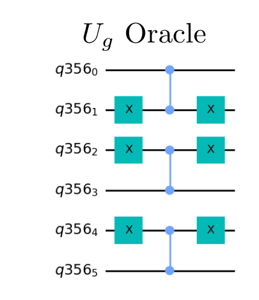
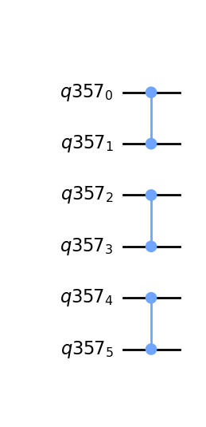

# Hidden Shift - Prototype Benchmark Program

The hidden shift algorithm [[1]](#references) is an algorithm that has previously 
been used to benchmark hardware [[2]](#references) [[3]](#references). 
While it is quite a contrived toy problem, it still provides an exponential speed up. It is a particularly interesting benchmark as it requires 
the same number of two qubit gates for a variety of hidden strings 

## Problem outline
Our problem is defined by first assuming we have some known Boolean function 
. 
We also have some sort of black box, which implements the function with the input bits shifted by 
, 
. 
Then, the goal of the problem is to find . 
However, as the function is highly non-linear, finding the string 
is non-trivial.

## Benchmarking
The hidden shift algorithm is benchmarked by running `max_circuits` circuits for different hidden bitstrings `s_int`, chosen uniformly at random from  for  qubits. Each circuit is repeated a number of times denoted by `num_shots`. We then run the algorithm circuit for numbers of qubits between `min_qubits` and `max_qubits`, inclusive. The test returns the averages of the circuit creation times, average execution times, fidelities, and circuit depths, like all of the other algorithms. For this algorithm's fidelity calculation, as we always have a single correct state, we compare the returned measurements against the distribution that has the single state with 100% probability using our [noise-normalized fidelity calculation](../_doc/POLARIZATION_FIDELITY.md).

## Classical algorithm
Classically, solving this problem would take  queries to identify the hidden shift [[2]](#references). Note that this is worse than the scaling from the Bernstein-Vazirani algorithm, as the function is non-linear.

## Quantum algorithm
We want the problem to be well formed for quantum hardware, so we choose a function which maps 
through a unitary as , 
such that . 
This conversion from a Boolean function to a *sign function* is done as .

Our black box will implement  
through the unitary , 
which applies onto a state as 

The algorithm also requires the ability to implement the dual bent function of 
, 
.
**We specifically choose a self-dual bent function of the Maiorana McFarland class [[4]](#references), 
such that** .

The function we choose is

 ,

remembering that . This function is specifically chosen such that it can be implemented as

,

where  
indicates a controlled-Z gate on qubits .

The quantum algorithm as described only requires a single query to the shifted function and a query to the original function. This means the number of queries is reduced to only , an exponential improvement.

### General Quantum Circuit 

*Fig 1. Diagram of general efficient quantum circuit for Hidden Shift Algorithm [[2]](#references)*

### Algorithm Steps
The steps for the Hidden Shift algorithm are the following, reproduced from the original paper's [[2]](#references) author's response to a stack overflow question [[5]](#references):

1. Initiate all qubits to .
    

    
    

2. Apply the Hadamard gate to all qubits.
   

   
   

3. Apply the quantum oracle  to all the qubits.
    

    
    

    

    
    

4. Apply the Hadamard gate to all qubits. The last step uses the fact that  because  is a self-dual bent function.
    

    
    

    

    
    
    
    

    
    

    

    
    

5. Apply the quantum oracle  to all the qubits.
    

    
    

    

    
    

6. Apply the Hadamard gate to all qubits
    

    
    

7. Measure all the qubits to determine the hidden string 

Review [[5]](#references) for a good explanation of how the math works, as this is an explanation from Martin Roetteler, the one who originally formulated the problem.

## Gate Implementation

### Implementation of 
The following are the subcircuits for a 6 qubit hidden shift algorithm with .

To implement  
as , we first apply  gates on qubits in  provide the bitwise transformation. Then, the  on neighboring pairs implements . Finally,  gates on qubits in  provides the same bitwise transformation back to the input string

### Implementation of 
To implement 
as , we apply  on neighboring pairs.

## References

[1] Martin R̈otteler. (2008).
    Quantum algorithms for highly non-linear Boolean functions.
    [`arXiv:0811.3208`](https://arxiv.org/abs/0811.3208)

[2] N. M. Linke, D. Maslov, M. Roetteler, S. Debnath, C. Figgatt, K. A. Landsman, K. Wright, and C. Monroe. (2017).
    Experimental Comparison of Two Quantum Computing Architectures.
    [`arXiv:1702.01852`](https://arxiv.org/abs/1702.01852)

[3] K. Wright, K. M. Beck, S. Debnath, J. M. Amini, Y. Nam, N. Grzesiak, J. -S. Chen, N. C. Pisenti, M. Chmielewski, C. Collins, K. M. Hudek, J. Mizrahi, J. D. Wong-Campos, S. Allen, J. Apisdorf, P. Solomon, M. Williams, A. M. Ducore, A. Blinov, S. M. Kreikemeier, V. Chaplin, M. Keesan, C. Monroe, and J. Kim. (2019).
    Benchmarking an 11-qubit quantum computer.
    [`arXiv:1903.08181`](https://arxiv.org/abs/1903.08181)

[4] Claude Carlet, Lars Eirik Danielsen, Matthew G. Parker, and Patrick Sole. (2010)
    Self-dual bent functions
    [`10.1504/IJICOT.2010.032864`](https://www.inderscience.com/info/inarticle.php?artid=32864)

[5] Martin R̈otteler. (2019).
    Quantum Computing Stack Exchange Answer.
    [`Hidden shift problem as a benchmarking function`](https://quantumcomputing.stackexchange.com/a/5873)