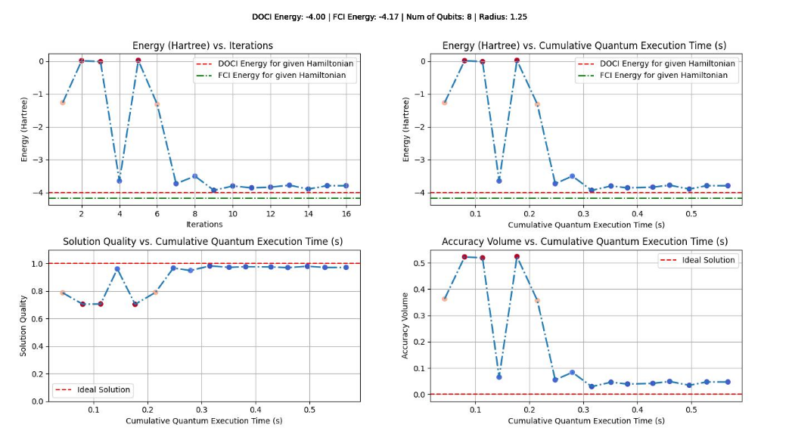

# Hydrogen Lattice - Benchmark Program

This benchmark uses the VQE algorithm as an example of a quantum application that can simulate the dynamics of a lattice arrangement of hydrogen atoms and determine its lowest energy state. The size and shape of the hydrogen lattice is configurable, allowing for performance tests at different levels of electron correlation. The hydrogen lattice system is of interest to benchmarking as it is relatively simple, scalable, can switch into regimes of interest (such as those with stronger electron correlations). In the 1D chain case can be compared to the result given by Density Matrix Renormalization Group (DMRG) method, since in this instance DMRG gives an exact solution. 

This benchmark was created as an extension of the existing MaxCut benchmarks, where the goal in this benchmark is to instead find and metricize the ground state energy solving of a hydrogen lattice configuration specified by a .json file. Using a particular ansatz, the ground state energy is found through VQE. This ansatz is currently the pUCCD, although in the future others may be specified. This energy is compared to a those in a corresponding .sol file. The energies in this file are calculated through classical methods. Both the .json and .sol files can be generated by `_common/instances/compute-vqe-problems-and-solutions.py`.  

The remainder of this README offers a brief summary of the benchmark and how to run it.  For more detail, please see the aforementioned paper.

## Problem outline

Using a variational optimization loop, the VQE algorithm calculates the ground state energy for a given Hamiltonian. While inherently approximate, it allows for efficient and noise-resistant quantum computation, both of which are particularly important for early quantum computer systems. By performing the algorithm on a lattice arrangement of hydrogen atoms, it is possible to create scalable benchmarks that provide metrics on how well current NISQ-era quantum computers can perform relative to each other and compared to current classical systems. 

## Benchmarking

As an extension to the MaxCut frameworks, several comparisons are easily made and may help in understanding how VQE benchmarking is performed. Similar to the MaxCut benchmarks, there are two primary benchmarking methods, denoted by methods 1 and 2. Method 1 runs a VQE ansatz at various lengths and widths, testing target system execution fidelities in a fashion very similar to method 1 of the MaxCut Framework. Method 2 runs the entire VQE algorithm, in which a paramaterized quantum system works in conjunction with a classical optimizer to approximate the ground state energy. While again very similar to the MaxCut framework, there are several key differences. In addition to iterating over the same circuit like in the MaxCut framework, the VQE benchmarks must iterate through multiple circuits to find the expectation value for each Pauli term in the Hamiltonian. Additionally, over the same number of qubits, we might want to run differnent Hamiltonians that describe lattices with different radii. These differences have led to metric collection and running of the benchmarks to behave differently than the MaxCut ones. 

In the run() method for the benchmark, there are a number of optional arguments that can be specified. While kept similar to MaxCut's own run() method, note that some argumenents have been necessarily changed. All of the arguments can be examined in the source code, but the key arguments that would typically be modifed from defaults are the following:

```
    Parameters
    ----------
    min_qubits : int, optional
        The smallest circuit width for which benchmarking will be done The default is 3.
    max_qubits : int, optional
        The largest circuit width for which benchmarking will be done. The default is 6.
    max_circuits : int, optional
        Number of restarts. The default is None.
    num_shots : int, optional
        Number of times the circut will be measured, for each iteration. The default is 100.
    method : int, optional
        If 1, then do standard metrics, if 2, implement iterative algo metrics. The default is 1.
    thetas_array : list, optional
        list or ndarray of theta values. The default is None.
    parameterized : bool, optional
        Whether to use parametrized circuits or not. The default is False.
    do_fidelities : bool, optional
        Compute circuit fidelity. The default is True.
    max_iter : int, optional
        Number of iterations for the minimizer routine. The default is 30.
    score_metric : list or string, optional
        Which metrics are to be plotted in area metrics plots. The default is 'fidelity'.
    x_metric : list or string, optional
        Horizontal axis for area plots. The default is 'cumulative_exec_time'.
    y_metric : list or string, optional
        Vertical axis for area plots. The default is 'num_qubits'.
```

### Metrics

Metrics generated for this benchmark suite generally compare the VQE energy at each iteration to some reference energy, such as those contained in the `.sol` files. Below is an explaination of the first three metrics, in addition to some examples. 

The first is the VQE energy itself, given in hartree. This energy can be compared to the `.sol` file energies, although it may be difficult from the energies alone to tell how good a solution is.

The second metric is known as the "solution quality", and is given by the following formula:

$$
\begin{aligned}
& \text { relative energy difference }=\left|\frac{E-E_{\mathrm{FCI}}}{E_{\mathrm{FCI}}}\right| \\
& \text { solution quality }=1-\frac{\arctan (\text { precision factor } \times \text { relative energy difference })}{\pi / 2}
\end{aligned}
$$

The solution quality goes from 0 to 1, with 1 being the closest to the target energy (FCI, in this case.) It scales with an arctan function. The "precision" factor determines how quality this arctan function saturates, and is arbitrarily specified. 

The third metric is known as the "accuracy" volume, and is given by the following formula:

$$
\text { accuracy volume }=\left|\frac{E_X-E_{\mathrm{FCI}}}{N}\right|
$$

where N is the number of electrons. This metric goes from 0 to infinity, with 0 being the most accurate to the target energy. 

The following is an example of how these metrics are displayed after running the benchmarks:

<p align="center">

</p>

<p align="center">

</p>

Note the several different types of plots. The top plot shows views of all three metrics with either the iteration number or cumulative quantum execution time on the X axis, while the bottom plot shows a different type of plot showing the accuracy volume as a function of the cumulative elapsed quantum time. 

## Problem Instances and Solutions

The framework used for hydrogen lattice benchmarking is reliant on problem `.json` files and solution `.sol` files. These files are stored within the `_common/instances` folder, and are used in the main benchmarking files to draw information on the Hamiltonians used for each hydrogen lattice, as well as classical solutions for the ground state energy of each hydrogen lattice.

Currently, the problem files contain information on the type and position of each atom, the electronic Hamiltonian in the pure qubit basis as well as the the hardcore bosonic mapping, and other metadata. The `.sol` file currently contains the ground state energy calculated by the FCI and DOCI methods, as well as the pure hartree-fock energy.

The problem and solution file names are formatted similarly as follows into 4 blocks separated by the `_` character:

`h[000-999]_[shape]_[000-999]_[00-99].json/sol`

The `[000-999]` number in the first block represents the number of qubits. The second block `[shape]` represents the hydrogen lattice shape. Currently, only 1D chains are used. The third and fourth blocks, `[000-999]_[00-99]`, represent the distance parameter $r$ to two decimal places of precision. The problem/solution files names are identical other than the filetype `.json` or `.sol` at the end. For example, a hydrogen chain problem instance file run on 18 qubits with distance parameter 11.25 would be:

`h018_chain_011_25.json`

### Generating Problem/Solution files

There are currently two ways to produce both problem instances/solution files. 

The most efficient method currently would be to run the `compute-vqe-problems-and-solutions.py` file located in the instances folder. This file computes both problem file `.json` and solution `.sol` files, and is currently configured to generate hydrogen lattice chains from 2 to 16 qubits, with distance parameter $r$ set to .75, 1.00, and 1.25. 

The second method, which is more inefficient, would be to first run the file `compute-instances.py`, which will generate hydrogen lattice chains problem files from 2 to 12 qubits with $r$ set to .75, 1.00, and 1.25. Next, run the `generate-instances.py` file, which will generate the `.sol` files using the previously generated problem files.  

Future versions of the code may allow for specifying the generation of problem and/or solution files from the terminal or through a GUI.

## Classical algorithm

Classical methods to solve the dynamics of quantum systems have been in development for many years, some of which are capable of finding ground state energies to chemical accuracy. Unfortunately, these chemically accurate methods tend to be very costly. We currently use the full-configuration interaction (FCI) as well as the doubly occupied configuration interaction (DOCI) to compute ground state energies, storing them in `.sol` files corresponding to each problem instance `.json`. Both methods, while exact, suffer from exponential scaling in time as system size grows, and it is the goal of the VQE to avoid this scaling problem. These energies are used to create comparative metrics. 

## Quantum algorithm

The VQE is a hybrid quantum algorithm where a parameterized ansatz is used to iteratively find the ground state energy of a system. For the benchmark, we start with a parameter value and calculate the expectation value of energy for a specified hydrogen lattice Hamiltonian.

VQE primarily uses the quantum computer to store and manipulate the eigenstate, meaning that the optimization step itself is done classically. This means that many optimization algorithms are compatible with VQE- two commonly used ones are COBYLA and SPSA. COBYLA is mostly used for noise-free simulations with simple Hamiltonians, wheras SPSA can better handle noise. For our benchmarking purposes, the COBYLA algorithm is used. A more detailed derivation of the particular style of VQE follows in the next paragraphs.

### General VQE 

Generally, the VQE consists of constructing a parameterized ansatz state $\Psi(\theta)$. Using this state, the energy is calculated as 

$$ E = \frac{<\Psi(\theta) | H | \Psi(\theta) >}{< \Psi(\theta) | \Psi(\theta) >}$$

Where H is the Hamiltonian of a system of interest. By varying the parameters $\theta$ to minimize the energy E, the ground state energy of H is approximated since by the variational principle, $E \geq E_{min}$, where $E_{min}$ is the ground state energy. This minimalization occurs in a hybrid fashion using a classical computer with classical optimization algorithms. 

Very generally speaking, systems of interest may be defined in bases other than the computational (qubit) basis. As an example, a Hamiltonian or ansatz might be defined in the fermionic basis, which is useful for chemistry problems. In this case, the Jordan-Wigner Transformation (JWT) is used: 

$a_p \mapsto \frac{1}{2}\left(X_p+\mathrm{i} Y_p\right) Z_1 \cdots Z_{p-1}$ [1]

The Hamiltonian therefore becomes a sum of weighed Pauli operators: 

$H=\sum_p g_p P_p$

Where $g_p$ are the ampltiudes and $P_p$ are the Pauli operators. The ansatz itself will be transformed into a different basis, resulting in it being in terms of the same Pauli operators.  

### General Quantum Circuit

VQE circuits generally consist of a state preparation state, with parameterized quantum gates then applied afterwards. With every iterative loop in the VQE, the parameterization is changed to account for whatever classical algorithm is being used for optimization.

Currently, we implement the pUCCD ansatz.

### pUCCD ansatz [2]
The unitary pair coupled cluster ansatz (upCCD or pUCCD) is currently the default (and only) ansatz available for the VQE benchmarking. This ansatz is given by:  

$$
\left|\Psi_{\mathrm{upCCD}}\right\rangle=e^{T-T^{\dagger}}|\mathrm{HF}\rangle
$$

Where the pair-double cluster operator T is,

$$
T=\sum_{i a} t_i^a d_a^{\dagger} d_i
$$

where \(i\) and \(a\) are the indices for occupied and unoccupied orbitals, \(d_a^{\dagger}\)  is the Fermionic creation operator, and \(d_i\) is the Fermionic destruction operator. 

Using a first-order trotterization, the sum in the exponential can be approximated via a multiplication over different exponential terms: 

$$
e^{T-T^{\dagger}} \approx \prod_{i a} e^{t_i^a d_a^{\dagger} d_i - {t_i^a}^* d_i^{\dagger} d_a}
$$

By performing the JWT mentioned in the previous section, it is possible to map both this ansatz to the qubit basis by first mapping the creation/destruction operators. 

$$
\begin{aligned}
d_a^{\dagger} & \rightarrow \frac{1}{2}\left(X_a-i Y_a\right) \\
d_i & \rightarrow \frac{1}{2}\left(X_i+i Y_i\right)
\end{aligned}
$$

Going back to the ansatz itself, this means that a single pair excitation term in the summation can be written instead with Pauli X and Y operators: 

$$
\exp \left(t_i^a\left(d_a^{\dagger} d_i-d_i^{\dagger} d_a\right)\right)=\exp \left(\frac{t_i^a}{2}\left(X_a Y_i-Y_a X_i\right)\right)
$$

With some derivation (see [2] and related papers), this can be efficiently implemented via the following gate:

<p align="center">

</p>

With this in mind, the pUCCD ansatz will generally consist of this quantum circuit applied over each pair excitation. See the section below for an example.

### Algorithmic Visualization

<p align="center">

</p>

The pUCCD ansatz on four physical qubits. The first section marked by the barriers is the initial Hartree Fock State, wheras the sections after represent the pair excitations operations implemented via the Givens rotations. The parameterizations with which optimizations occur are in the $R_Y$ gates. Using this circuit in combination with a a paired-electron mapping for the Hamiltonian allows for a constant number of circuit measurements (3), as well as theoretically being able to simulate eight qubit systems. 

### Algorithm Steps

<p align="center">

</p>

## Gate Implementation

Described in more detail in the paper.

## Circuit Methods

Described in more detail in the paper. 

## References

[1] Google Open Fermion Documentation Team. (2021). [`The Jordan-Wigner and Bravyi-Kitaev Transforms`](https://quantumai.google/openfermion/tutorials/jordan_wigner_and_bravyi_kitaev_transforms)
[2] Zhao, L., Goings, J., Shin, K. _et al._ Orbital-optimized pair-correlated electron simulations on trapped-ion quantum computers. _npj Quantum Inf_ **9**, 60 (2023). https://doi.org/10.1038/s41534-023-00730-8kj
