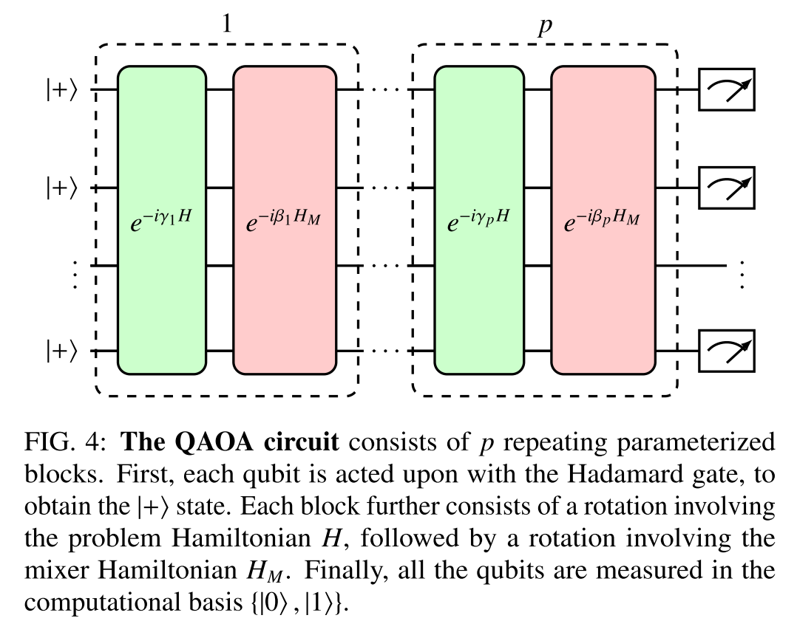
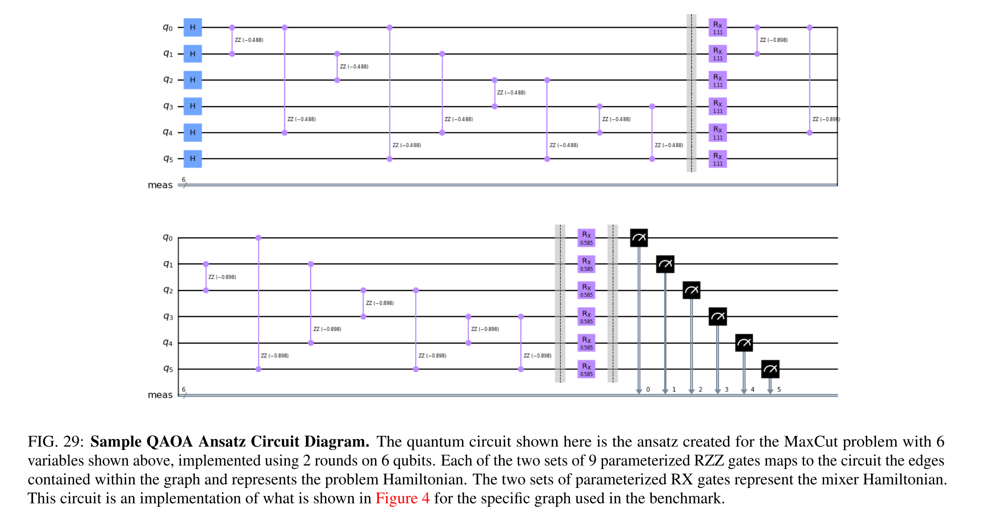
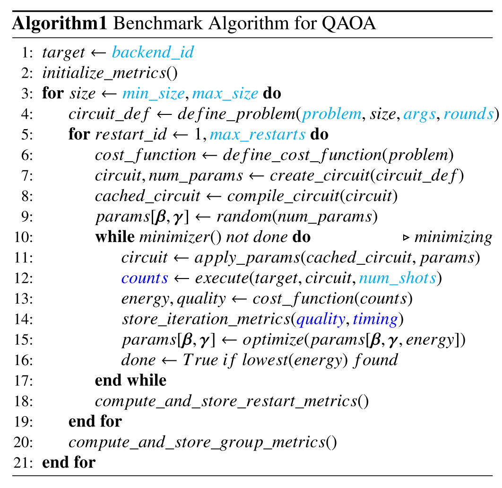
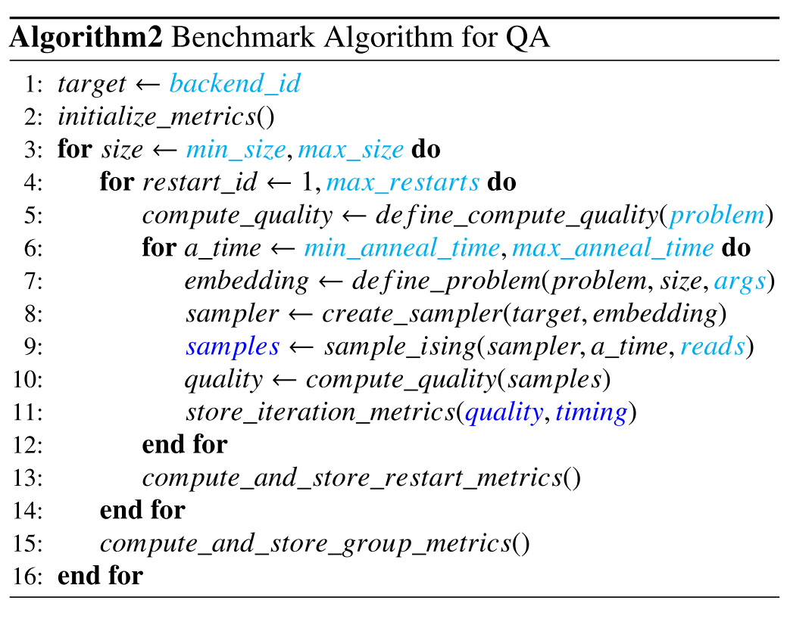

# MaxCut Algorithm - Benchmark Program

This benchmark uses the MaxCut algorithm [[1]](#references) as an example of a quantum application that solves a combinatorial optimization problem.
With the MaxCut algorithm, the goal is to find the maximum cut size of an undirected graph.
It is representative of a class of optimization problems that are easy to specify but difficult to solve efficiently, NP-HARD problems.
These often arise from mapping practical applications to computing hardware and can appear as subroutines in composite algorithms.
The Max-Cut problem offers a simple early-stage target for evaluating the effectiveness of quantum computing solutions that are hybrid in nature, i.e. combining both classical and quantum computation.

This benchmark measures the performance characteristics of quantum computing systems when executing a combinatorial optimization application that uses either the QA and QAOA algorithms and can evaluate the gate model and annealing styles of quantum computing side-by-side.
It is designed to provide insight into unique aspects of quantum computing while maintaining a presentation recognizable to practitioners in the optimization field and uniformly captures, analyzes, and presents metrics associated with the execution of both models of quantum computing to support comparisons across architectures.

The QED-C committee which developed these benchmarks released (Feb 2023) a second pre-print of a paper describing the addition of combinatorial optimzation problems as advanced application-oriented benchmarks. This paper provides much detail about the theory and concrete implementation of the benchmark contained in this repository. 

&nbsp;&nbsp;&nbsp;&nbsp;[Optimization Applications as Quantum Performance Benchmarks](https://arxiv.org/abs/2302.02278)

The remainder of this README offers a brief summary of the benchmark and how to run it.  For more detail, please see the aforementioned paper.

## Problem outline

The MaxCut algorithm, in which the goal is to find the maximum cut size of an undirected graph, is representative of a class of opti- mization problems that are easy to specify but difficult to solve efficiently, NP-HARD problems. As such, benchmarking the MaxCut algorithm gives insight into establishing quantum benchmarks for optimization tasks.

## Benchmarking

The MaxCut algorithm is benchmarked in slightly different ways for QOAO (gate model) and QA (quantum annealing).

For QAOA, currently implemented only via Qiskit, there are two benchmark methods provided. The first, specified as method = 1, simply executes the MaxCut ansatz circuit at different widths to gauge the fidelity of execution that is achieved by a particular target system.  The second, method = 2, executes the complete MaxCut algorithm, in which the ansatz circuit is executed multiple times under the control of a classical optimizer, (default = COBYLA), which attempts to find circuit parameters that yields the greatest approximation ratio for its solutions.

For QA, only the second method is supported, as there is no use of an ansatz circuit. With method = 2, the benchmark execute the QA algorithm multiple times, cycling though a series of annealing times, ranging from 1 us to 256 us, and measuring the total execution time and quality of the result obtained. This execution multiple times is designed to mimic the iterative ansatz execution of QAOA, but in a way that is unique to QA. 

In both cases, the results are displayed in a performance profile that illustrates the tradeoff between total time of execution and the quality of result that can be achieved.
The details underpinning the QAOA and QA algorithms, their implementation for benchmark purposes, and the displays that are produced are explained in detail in the paper that is referenced in the first section of this README above.

In the run() method for the benchmark, there are a number of optional arguments that can be specified. All of the arguments can be examined in the source code, but the key arguments that would typically be modifed from defaults are the following:
```
    method : int, optional
        If 1, then do standard metrics, if 2, implement iterative algo metrics. The default is 1.
    rounds : int, optional
        number of QAOA rounds. The default is 1.
    degree : int, optional
        degree of graph. The default is 3. Can be -3 also.
    thetas_array : list, optional
        list or ndarray of beta and gamma values. The default is None, which uses [1,1,...].
    use_fixed_angles : bool, optional
        use betas and gammas obtained from a 'fixed angles' table, specific to degree and rounds
    parameterized : bool, optional
        Whether to use parametrized circuits or not. The default is False.
    max_iter : int, optional
        Number of iterations for the minimizer routine. The default is 30.
    score_metric : list or string, optional
        Which metrics are to be plotted in area metrics plots. The default is 'fidelity'. For method 2 s/b 'approx_ratio'.
    x_metric : list or string, optional
        Horizontal axis for area plots. The default is 'cumulative_exec_time' Can be 'cumulative_elapsed_time' also.
```

## Classical algorithm

Combinatorial optimization applications are often executed under tight resource constraints (e.g., time, memory, energy, or money), and there is particular emphasis on quantifying the quality of results that could be obtained within a limited budget.

## Quantum algorithm

As discussed above, QAOA is used. The ansatz used is 

<p align="center">

</p>

The Max-Cut problem can be framed in terms of obtaining the ground state of the Hamiltonian

<p align="center">
{\in}E}(1-Z_iZ_j)"/>
</p>


In order to characterize the quality of solutions, a quantity called the approximation ratio is usually computed. The approximation ratio r is defined as the ratio of the energy expectation value  and the ground state energy value .

<p align="center">

</p>

In Quantum Annealing, an optimization problem is encoded into the machine, after which the solution is determined through quantum adiabatic evolution to arrive at a near-optimal final state. The algorithmic approach of quantum annealing is to leverage the dynamic evolution of a quantum system to transform an initial ground state (which is easy to prepare) into the ground state of a target Hamiltonian, which is unknown and difficult to compute by other means.

<p align="center">

</p>

States starts at (s=0). Currently available quantum annealing hardware focuses on a special case that is limited to the Transverse Field Ising model:

<p align="center">

</p>


### General Quantum Circuit

   <p align="center">
   
   </p>

### Algorithmic Visualization

   <p align="center">
   
   </p>

Described in detail in the referenced paper.

### Algorithm Steps

   <p align="center">
   
   </p>
   
      <p align="center">
   
   </p>

## Gate Implementation

Described in detail in the referenced paper.

## Circuit Methods

Described in detail in the referenced paper.

## References

[Solving combinatorial optimization problems using QAOA (Qiskit Tutorial)](https://qiskit.org/textbook/ch-applications/qaoa.html)

[Unique Games hardness of Quantum Max-Cut,
and a vector-valued Borell’s inequality](https://arxiv.org/pdf/2111.01254.pdf)

[Max-Cut and Traveling Salesman Problem (Qiskit Tutorial)](https://qiskit.org/documentation/optimization/tutorials/06_examples_max_cut_and_tsp.html)

[Almost optimal classical approximation algorithms
for a quantum generalization of Max-Cut](https://arxiv.org/pdf/1909.08846.pdf)

[Quantum Approximate Optimization Algorithm for MaxCut: A Fermionic View](https://arxiv.org/pdf/1706.02998.pdf)
