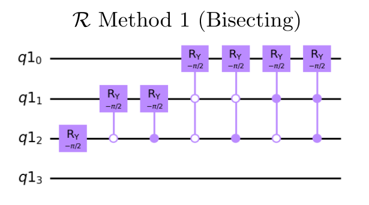
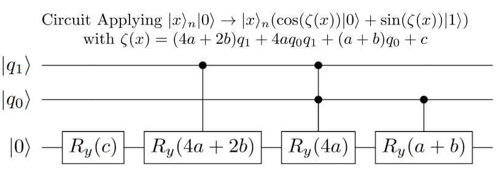
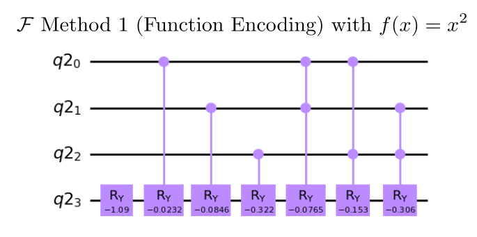
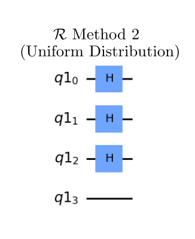
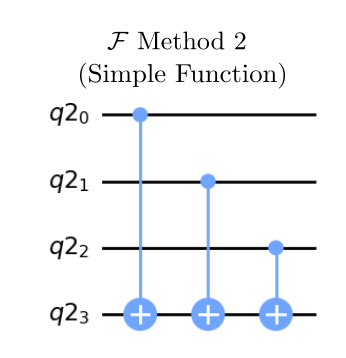

# Monte Carlo - Prototype Benchmark Program

The Quantum Monte Carlo Sampling Algorithm presented here is an application of the [Quantum Amplitude Estimation](../amplitude-estimation) routine we implemented as benchmark. We notice that this quantum algorithm performs quadratically better than any known classical algorithm. We follow the process outlined in [[1]](#references).

## Problem outline

This algorithm aims to estimate the expected value of some function of a random variable  given quantum oracle access to the probability distribution of the variable  and the function of interest . For a distribution  which is potentially not analytically known or otherwise difficult to calculate directly, it might not be feasible to get an exact result for the expectation value of the function applied to the distribution. Both the classical and quantum versions of the algorithm utilize methods to approximate this expectation value by utilizing calls to the distribution.

## Benchmarking

The Monte Carlo algorithm is benchmarked in two different ways: for method 1, we run `max_circuits` circuits for random Gaussian distributions with mean  values of the form  where  represents the total number of qubits in register 1 and  is an integer between  and  and for method 2, we run only a single circuit with the specific distribution. Each circuit is repeated a number of times denoted by `num_shots`. We then run the algorithm circuit for numbers of qubits between `min_qubits` and `max_qubits`, inclusive. The test returns the averages of the circuit creation times, average execution times, fidelities, and circuit depths, like all of the other algorithms. For this algorithm's fidelity calculation, the algorithm can return a distribution when the number of qubits in register 1 is finite, so we compare against the analytical expected distribution using our [noise-normalized fidelity calculation](../_doc/POLARIZATION_FIDELITY.md).

## Classical algorithm

The classical Monte Carlo process, in general, defines a random process which gives values according to the distribution, and then takes an average over the function evaluated at these values. This can be used to calculate empirical estimates for quantities of interest; for example, repeatedly drawing five cards at random from a standard deck of playing cards to approximate the theoretical probabilities of specific hands in poker. Such sampling methods are often referred to as Monte Carlo, and can also play a key role in non-deterministic algorithms. 

The process is usually such that the sample average is an unbiased estimator of the expected value of the underlying distribution. Then, due to the Central Limit Theorem, the variance of the mean of  samples collected in this way will scale as . We use the scaling of the variance of the mean as a gauge for comparing the classical and quantum algorithms, as a better scaling would require less samples to achieve the same uncertainty in the estimate.

The scaling with the size of the sample space  can depend on the choice of sampling implementation, but it often scales as .

## Quantum algorithm

With the quantum algorithm, our probability distribution and function are instead coded into calls to a quantum oracle. We can then use the ideas of Quantum Amplitude Estimation to return an estimate of the exectation value which has variance decreasing quadratically faster than ordinary classical sampling.

Using  calls to the oracles, the variance scales in the best case as , and in the most limited case with bounded error as  [[1]](#references). Even this worst case improves convergence compared to classical Monte Carlo sampling estimation, which scales as  for  samples. 

To encode information about our distribution and function we define the following operators which will be called as oracles;  defined on  qubits such that:

   

In this context,  prepares the zero state into the all real-valued superposition according to the desired measurement probabilities, while  encodes the value of the function  of the state of the  qubit register  into the objective qubit at the end. The product of these two is:

If we remember that the expection value we are looking for is defined as 

we can see that if there is an efficient way of estimating the amplitude on the objective qubit in the  state, there is an efficient way to estimate the expected value of the function on the random variable  As in quantum amplitude estimation, we aim to estimate  from the application

we can clearly see that using  and , Amplitude Estimation will allow us to find the value . For information about this subroutine, please refer to the [Amplitude Estimation benchmark](../amplitude-estimation/), as our implementation of QAE in this benchmark is identical.

### Correct Distribution

The fidelity calculation we use in this benchmark is significantly more involved than in some of the other benchmarks. The amplitude estimation algorithm has granularity in the number of answers it can return as a result of the finite number of counting qubits (the number of qubits in the first register in phase estimation). This means that unless we have an infinite number of counting qubits, our probability of getting back the closest estimate will always be less than 1, though it will be peaked at the closest estimate [[2]](#references).

To generate the correct distribution to compare to, we use that the probability of measuring the raw bitstring  from the counting qubits is given by equation (5.25) in [[2]](#references) as

,

with  being the number of counting qubits, and  being the correct phase in the state with eigenvalue . Note, in this explanation, we are being a bit vague about the transformation between amplitude estimation, phase estimation, and our shifted functions for the sake of brevity.

### General Quantum Circuit

*Fig 1. Diagram of general quantum circuit for [Quantum Amplitude Estimation](../amplitude-estimation/)*

### Algorithm Steps

1. Generate the amplitude generator  from the function  and distribution .

2. Use [Amplitude Estimation](../amplitude-estimation/) to find the amplitudes.

3. If using method 1, shift the amplitudes according to the inverse shift outlined in the section on Implementing F (method 1).

## Gate Implementation

To generate our amplitude amplification operator  used in the amplitude estimation routine, we need to have a gate implementation of our probability distribution and function. In this benchmark, we implement two methods for generating these two elements of a Monte-Carlo simulation:

- **Method 1** implements circuits for  and  which allows arbitrary distributions and functions. This generally results in much deeper circuits. Our default choices for  and  are a truncated Gaussian distribution with variable mean and the function .
- **Method 2** implements circuits for  and  which are extremely simple distributions and functions. This allows the algorithm to run with much less deep circuits. For , we use a uniform distribution, and for , we use a function similar to the balanced oracle used in the [Deutsch-Jozsa algorithm](../deutsch-jozsa/).

### Implementing R (method 1)

To generate  for an arbitrary probability distribution we use methods introduced in [[3]](#references). We use the intuition that a distribution can be broken into successive bisectings of regions. This property can be visualized in the below image, where we are estimating the probability of being in a specific region of a Gaussian distribution. We have each sector labeled by the qubit state which would have this probability, with the height being the corresponding probability.

We start off with our first bisection (in red), where for this Gaussian distribution, we have an even chance of being in the left or right region. We then apply this halving again for both sections. We then bisect each region again (orange), calculating the probability of being in the left or right side given we are know we are in one of the sides of the distribution. For example, we multiply the probability of being in the left side of the left region to find the total probability of being in the first of the now four regions.

If we iteratively apply this algorithm, we see that by just dividing up the regions, we can fully generate any probability distribution with however many qubits we want.

In order to implement this process, we use controlled Ry gates, as when an Ry gate acts only on a single qubit in the 0 state, the rotation is applied as:

This will clearly split any region in half with arbitrary probabilities for the two states determined by the angle theta. The controlled aspect applies the part of the algorithm where we are given that we are in a particular region. This can be noticed on the above image by noticing that any two states below a region have the same first qubits, with the last, new qubit being either a 0 or 1.

Below is an example circuit which uses this bisecting method to create a uniform superposition. With the angle , we are evenly distributing between the two halves of the region. Then, by using controlled operations based on if the controlled qubit is 1 (0), shown by the closed (open) circle, we select which region be are bisecting. Note we do not modify the last qubit, as when applying , we leave the last qubit for defining the correct states in .

To see more in-depth explanation of how this process works, the math is explaned in a more detail in [[3]](#references).

---

### Implementing F (method 1)

In implementing our , we follow the process outlined in [[1]](#references). This uses the idea that if we have an operation of the form:  with  as a polynomial, then this operator can be efficently constructed with multi-controlled Y-rotations. So, we have two steps to implementing : transforming our function such that  and then impelementing this polynomial via controlled rotations.

To generate our , instead of just setting this equal to , we instead find a Taylor approximation of 

with  where  is the desired error in the approximation, and  is the degree of the Taylor approximation for . The default values are  and , which have shown to perform well without introducing additional errors. This shift in  leads to a better approximation; the mathematical reasonings for choosing this shift is explained in depth in [[1]](#references).

Now that we have , we can describe how to implement this polynomial via controlled rotations. To do this, we find a way of representing the polynomial in terms of sums of products of the states on each qubit. For example, for  and 2 data qubits, we can use that , with  representing the state of qubit . Then, utilizing  allows us to write our polynomial as . The mapping  is then applied by the circuit below, which can clearly be seen to apply the equation with a little thought.

Finally, we give an example of what this circuit looks like when  with the default parameters and 3 data qubits:

---

### Implementing R (method 2)

For our  method 2, our distribution is just a uniform distribution on all states, which can be easily implemented with Hadamards on all qubits. Again, since we use the last qubit for distinguishing states when applying , we do not modify it when preparing   .

---

### Implementing F (method 2)

For our  in method 2, we describe a simple circuit where in ,  if  has an odd number of 1's in its binary expansion, and is 0 otherwise. This is clearly implemented by the below circuit of successive controlled NOT operations. We also note that because this function does not use the shifts described in  method 1, we no longer need to do any shifting or inverse shifting of the measured amplitudes.

## References

[1] Woerner, S., Egger, D.J. Quantum risk analysis. npj Quantum Inf 5, 15 (2019). 
    [`doi:10.1038`](https://doi.org/10.1038/s41534-019-0130-6)

[2] Michael A. Nielsen and Isaac L. Chuang. (2011).
    Quantum Computation and Quantum Information: 10th Anniversary Edition (10th ed.). 
    Cambridge University Press, New York, NY, USA.

[3] Lov Grover, Terry Rudolph. (2002)
    Creating superpositions that correspond to efficiently integrable probability distributions.
    [`arXiv:quant-ph/0208112`](https://arxiv.org/abs/quant-ph/0208112)
