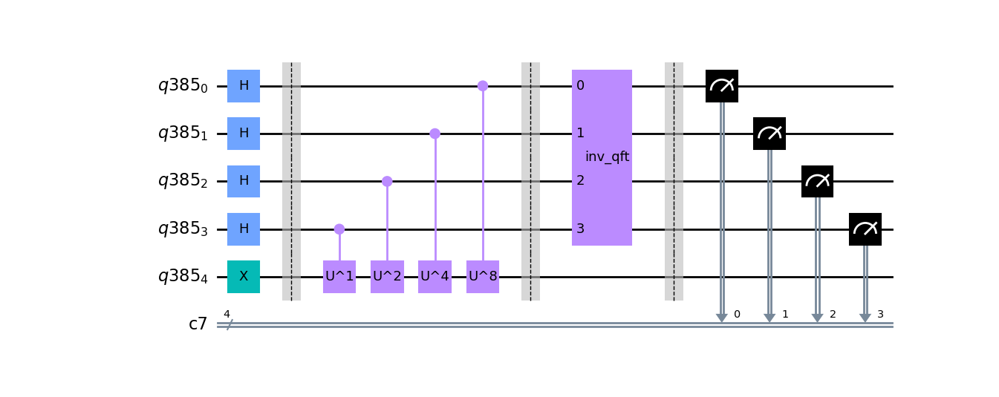

# Quantum Phase Estimation - Prototype Benchmark Program

Phase estimation [[1]](#references) is one of the most important quantum subroutines, fundamental to most quantum 
algorithms such as [Shor's Order Finding](../shors/) and the HHL algorithm for solving linear systems of equations. 
The algorithm utilizes the [Quantum Fourier Transform](../quantum-fourier-transform/)
as a key procedure, which is described and implemented as a benchmark in this repository. 

## Problem outline
The goal of the Quantum Phase Estimation (QPE) algorithm is to estimate the eigenvalues of a unitary operator.
Specifically, QPE estimates a value 
for a given unitary operator  defined as 

.

where  is an
eigenvector with  
as the corresponding eigenvalue for .

## Benchmarking

The Phase Estimation algorithm is benchmarked by running `max_circuits` circuits for random  values of the form  where  represents the total number of qubits in the counting register and  is an integer between  and . Each circuit is repeated a number of times denoted by `num_shots`. We then run the algorithm circuit for numbers of qubits between `min_qubits` and `max_qubits`, inclusive. The test returns the averages of the circuit creation times, average execution times, fidelities, and circuit depths, like all of the other algorithms. For this algorithm's fidelity calculation, because we chose  to never require more precision than the number of counting qubits can provide, we compare the returned measurements against the distribution that has the single state with 100% probability using our [noise-normalized fidelity calculation](../_doc/POLARIZATION_FIDELITY.md).

## Classical algorithm
Classically determining the eigenvalues of a -by- operator  involves performing eigendecompostion which 
reduces down to basic matrix multiplication. For an arbitary operator, eigenvalue decomposition involves matrix 
multiplication which has  time.
However, using the Coppersmith and Winograd algorithm, eigenvalue decomposition for a unitary operator has 
 time where 
 [[2]](#references). This
produces a symbolic determinant which is used to recover all the eigenvalues.
Then acquiring  bits of the eigenvalue has complexity of   since
the operations take place over  degree polynomials with coefficients in  bits [[2]](#references). With more 
complex methods, to approximate the eigenvalue within  has
 time [[3]](#references).

## Quantum algorithm

The quantum algorithm has a runtime of about  
which is dependent solely on the amount of bits  required to represent the eigenvalue. Since the complexity time
of the classical algorithm is dependent on both the order  of the unitary matrix and , determining whether the quantum
or classical algorithm performs better is dependent on these relevant variables. However, the real use of 
quantum phase estimate comes from the fact that many other interesting problems can be reduced to phase 
estimation, leading to more dramatic improvements in complexity time for other algorithms. The general
quantum phase estimation algorithm will be summarized below along with its implementation in this benchmark.

### General Quantum Circuit
The following circuit is the general quantum circuit for quantum phase estimation with  qubits in the counting register and the bottom qubits representing the  
state as the data register.

*Fig 1. Diagram of general quantum circuit for Phase Estimation Algorithm [[4]](#references)*

When  can be represented by a  bit binary expansion, QPE solves for  exactly. 
In other cases, it can be shown the output measurement is an approximation of  accurate to 
 bits with probability of success at least 
. Similarly stated,
to obtain  accurate to  bits with probability of success at least ,
choose  counting qubits.

This quantum algorithm has a runtime of  
operations and one call to the controlled- 
operator that succeeds with probability of at least . 
References [[4]](#references) and [[5]](#references) both have overviews of the mathematical details of the 
algorithm, but the key points will be reproduced here.

### Algorithm Steps
The steps for phase estimation are the following: 

1. The procedure uses two registers. We initialize  qubits to  which represent the counting register. This register
   will store the value  by the end of the algorithm.
   The second register contains the state  with as many qubits
   as necessary to store the state:
   
   

   
   

   
2. Apply a -bit Hadamard gate operation to the counting register:
    
   

       
   

   

   
   

   

   
    

   where  denotes the integer representation of -bit binary numbers.

3. Next, the  controlled unitary operators are applied on the data register as shown in the circuit above.
   Recall since  is a unitary operator with eigenvector  such that
   , then
   
   

   
   

   

   
   

   
4. The previous expression is the same derived expression for the quantum Fourier transform on 
   a -qubit input state where  is replaced by . 
   Review the [Quantum Fourier Transform](../quantum-fourier-transform/) benchmark for the full derivation.
   Thus applying the inverse QFT to  retrieves 
    in the counting register:
  
   

      
   

   

   
   

   
5. Finally, measure the counting register in the computational basis. The above expression peaks 
   near  and when  
   is an integer then the measured output becomes the following which includes the phase exactly in the counting register:
   
   

   
   

   
   When  is not an integer it can be shown the above expression peaks near 
   with probability better than  [[4]](#references).

## Gate Implementation
In this benchmark, we chose to only have a single qubit in the data register, using CPHASE gates as our C-U. For these gates, the state  has eigenvalue , with  tunable.

This benchmark's gate implementation deviates slightly from way we've described the algorithm above in one important way: our C-U gates start with the most significant qubit in the counting register and work towards the least significant qubit. This can bee seen in the below image of the circuit we apply:

This is because the benchmark uses this repository's internal inverse quantum Fourier transform gate. Like we mention in the [Quantum Fourier Transform benchmark](../quantum-fourier-transform/), we have removed the cannonical swaps to improve performance. This means that our qubits are instead ordered in the reverse way by the inverse QFT gate, which is why our applications of C-U work the other way around.

## References

[1] Hamed Mohammadbagherpoor, Young-Hyun Oh, Patrick Dreher, Anand Singh, Xianqing Yu, Andy J. Rindos. (2019).
    An Improved Implementation Approach for Quantum Phase Estimation on Quantum Computers.
    [`arXiv:1910.11696`](https://arxiv.org/abs/1910.11696v1)

[2] Josh Alman, Virginia Vassilevska Williams. (2020).
    A Refined Laser Method and Faster Matrix Multiplication.
    [`arXiv:2010.05846`](https://arxiv.org/abs/2010.05846)

[3] Victor Y. Pan, Zhao Q. Chen. (1999).
    The Complexity of the Matrix Eigenproblem.
    [`doi.org/10.1145/301250.301389`](https://dl.acm.org/doi/abs/10.1145/301250.301389)

[4] Michael A. Nielsen and Isaac L. Chuang. (2011).
    Quantum Computation and Quantum Information: 10th Anniversary Edition (10th ed.). 
    Cambridge University Press, New York, NY, USA.

[5] Abraham Asfaw, Antonio Córcoles, Luciano Bello, Yael Ben-Haim, Mehdi Bozzo-Rey, Sergey Bravyi, Nicholas Bronn, Lauren Capelluto, Almudena Carrera Vazquez, Jack Ceroni, Richard Chen, Albert Frisch, Jay Gambetta, Shelly Garion, Leron Gil, Salvador De La Puente Gonzalez, Francis Harkins, Takashi Imamichi, Hwajung Kang, Amir h. Karamlou, Robert Loredo, David McKay, Antonio Mezzacapo, Zlatko Minev, Ramis Movassagh, Giacomo Nannicini, Paul Nation, Anna Phan, Marco Pistoia, Arthur Rattew, Joachim Schaefer, Javad Shabani, John Smolin, John Stenger, Kristan Temme, Madeleine Tod, Stephen Wood, and James Wootton. (2020).
    [`Quantum Phase Estimation`](https://qiskit.org/textbook/ch-algorithms/quantum-phase-estimation.html#1.) 

