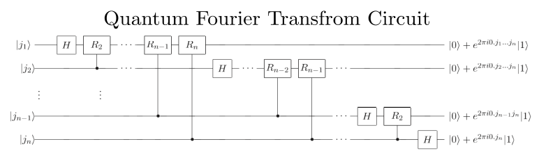
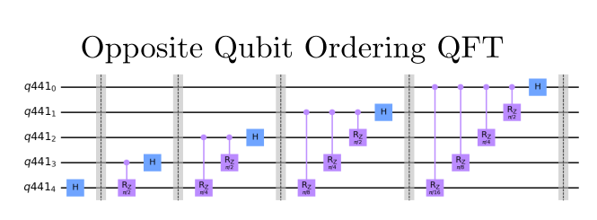
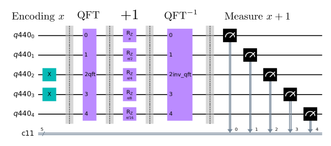
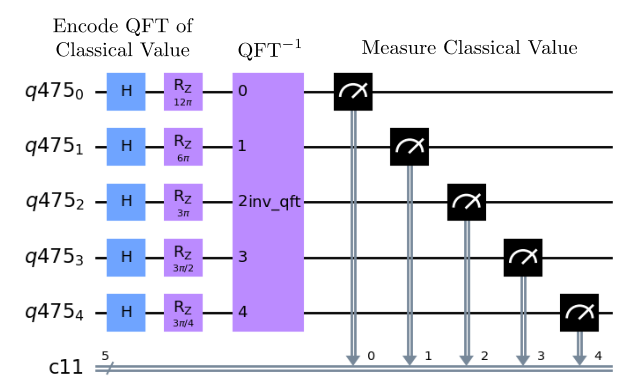
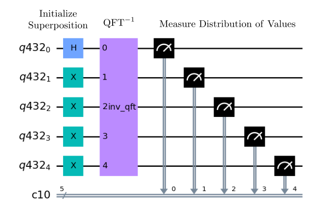

# Quantum Fourier Transform - Prototype Benchmark Program

The Quantum Fourier Transform [[1]](#references) is one of the most important operations in quantum computing 
as it is a key ingredient for [Quantum Phase Estimation](../phase-estimation/) and [Shor's Order Finding](../shors/),
as well as more complicated algorithms. As such this algorithm offers a compact and practical circuit that can be 
run on present day NISQ hardware and used as a benchmark of a machine's performance. However, the Quantum 
Fourier Transform does not speed up the classical task of computing the Fourier transform of classical data.
This benchmark implements three different methods of benchmarking the Quantum Fourier Transform.

## Problem outline
The goal of both the classical and quantum Fourier transform is to transform a vector from the computational
basis to the Fourier basis. The classic discrete Fourier transform maps the vector 
 such that

.

The quantum Fourier transform performs the same transformation on the computational basis such that a basis state undergoes the following transformation

.

Thus applying the quantum Fourier transform on an arbitrary state results in the following:

.

## Benchmarking
The quantum Fourier transform algorithm is benchmarked by running `max_circuits` circuits for different initial bitstrings in method 1, for different encoded QFT states in method 2, and for structured transformed states in method 3. Each circuit is repeated a number of times denoted by `num_shots`. We then run the algorithm circuit for numbers of qubits between `min_qubits` and `max_qubits`, inclusive. The test returns the averages of the circuit creation times, average execution times, fidelities, and circuit depths, like all of the other algorithms. For this algorithm's fidelity calculation in method 1 and 2, as we always have a single correct state, we compare the returned measurements against the distribution that has the single state with 100% probability using our [noise-normalized fidelity calculation](../_doc/POLARIZATION_FIDELITY.md). For the third method, we compare against the correct distribution. 

Currently method 3 is still a work in progress benchmark and should not be run for accurate results. We suggested method 3 as a way to benchmark QFT on a state that will return an entangled result. As method 1 and 2 both initialize states which are non-entangled, the QFT could essentially be done classically. However, by nature of how method 3 generates states, depolarizing errors are unable to be caught by the benchmark. This demonstrates how care has to be used when designing benchmarks motivated by applications.

## Classical algorithm
The best classical algorithm for computing the discrete Fourier transform is the Fast Fourier Transform which computes the discrete
Fourier transform of a  element using 
 gates [[2]](#references).

## Quantum algorithm
The quantum Fourier transform utilizes 
gates to convert a quantum state from the computational basis to the Fourier basis. This is exponentially less gates than the classical fast Fourier transform. 
However, the quantum Fourier transform does not compute the classical Fourier transform because the Fourier transform coefficients cannot 
be directly accessed via measurement. Thus this algorithm does not compute the classical fast Fourier transform faster, but instead the quantum Fourier transform is useful for more complicated quantum algorithms. Thus the only advantage of QFT over the classical Fourier transform is that the quantum Fourier transform on a quantum computer requires exponentially less gates than computing the fast Fourier transform on a classical computer.

### General Quantum Circuit
The following circuit is the general quantum circuit for an  qubit state where the gate 
 denotes
.

*Fig 1. Diagram of general efficient quantum circuit for Quantum Fourier Transform [[2]](#references)*

### Algorithm Steps
The recursive steps in generating the Quantum Fourier Transform for a  qubit state are the following:
1. Apply the Hadamard gate to the first qubit
2. Apply the controlled- gate on the first qubit
   controlled by the second qubit
3. Repeat Step 2  times applying the controlled-
   on the first qubit.
4. Repeat Steps 1-3 for each qubit
5. Apply SWAP gates between the first and last qubit, second and second to last qubit, and so on. 
   These SWAP gates are used to order the qubits to match the QFT stated described above.
   These SWAP gates are not shown in the circuit diagram above.

The Qiskit Tutorial on QFT [[3]](#references) is quite helpful to provide further explanations.

## Gate Implementations
Unlike the circuit diagram above, the quantum Fourier transform implementation in this benchmark 
starts the iterative process from the last qubit, the th qubit, to the first qubit. Below is an example for a 5 qubit system:

This implementation does not require the SWAP gates at the end of the circuit. Instead the qubits can be reordered
classically to achieve the desired QFT state. This is beneficial because it reduces the overall circuit depth and size of the algorithm and aligns
the circuit with realistic implementations of QFT.

## Circuit Methods
This benchmark involves three different methods of circuit creation to benchmark both the quantum 
Fourier transform and inverse quantum Fourier transform.

- **Method 1**: Initialize inputs to a classical value , perform QFT, rotate the qubits to increase  by 1 in the Fourier basis
   followed by the inverse QFT. It is expected that the measured output would match exactly the input value *x+1* to the circuit. 
   This method benchmarks the following circuit:
    
   

   
   

   
- **Method 2** Initialize inputs to represent the result of a QFT on a classical value followed by the inverse QFT to retrieve
   the expected classical value. This method benchmarks the following circuit: 
   
   

   
   

- **Method 3** Initialize the inputs to a quantum superposition, perform an inverse QFT, and 
   determine how closely the measured output matches the expected measurements for the given input value. Note: this method has substantial problems and does not report a fidelity consistent with the other benchmarks.
   This method benchmarks the following circuit:
   
   

   
   

Method 1 is used as the default while the second and third are provided as alternatives. 

The method may be passed to the run() function, using the 'method=method' parameter, where method can be 1, 2 or 3.

## References

[1] D. Coppersmith (1994).
    An approximate Fourier transform useful in quantum factoring
    [`arXiv:quant-ph/0201067`](https://arxiv.org/abs/quant-ph/0201067)

[2] Michael A. Nielsen and Isaac L. Chuang. (2011).
    Quantum Computation and Quantum Information: 10th Anniversary Edition (10th ed.). 
    Cambridge University Press, New York, NY, USA.

[3] Abraham Asfaw, Antonio Córcoles, Luciano Bello, Yael Ben-Haim, Mehdi Bozzo-Rey, Sergey Bravyi, Nicholas Bronn, Lauren Capelluto, Almudena Carrera Vazquez, Jack Ceroni, Richard Chen, Albert Frisch, Jay Gambetta, Shelly Garion, Leron Gil, Salvador De La Puente Gonzalez, Francis Harkins, Takashi Imamichi, Hwajung Kang, Amir h. Karamlou, Robert Loredo, David McKay, Antonio Mezzacapo, Zlatko Minev, Ramis Movassagh, Giacomo Nannicini, Paul Nation, Anna Phan, Marco Pistoia, Arthur Rattew, Joachim Schaefer, Javad Shabani, John Smolin, John Stenger, Kristan Temme, Madeleine Tod, Stephen Wood, and James Wootton. (2020).
    [`Quantum Fourier Transform`](https://qiskit.org/textbook/ch-algorithms/quantum-fourier-transform.html)

