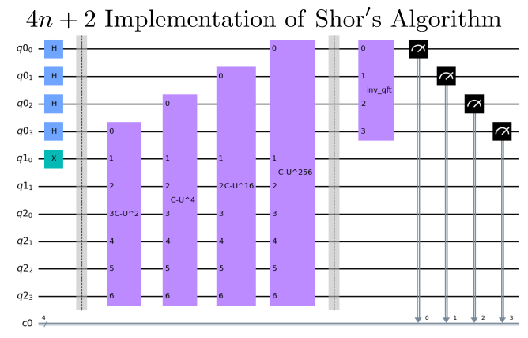
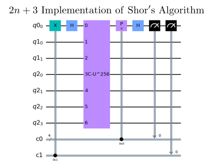

# Shor's Order Finding Algorithm - Prototype Benchmark Program

Shor's Factoring Algorithm [[1]](#references) is one of the most well-known and arguably famous applications of quantum computing.
Shor's algorithm exponentially factors a product of any two primes faster than a classical computer which, currently can achieve
this goal in superpolynomial time. However the resources required to factor even a small number is significant.
For this reason, it serves as a useful benchmark to stretch the capabilities of current quantum hardware. Two versions of Shor's order finding algorithm are benchmarked with the difference between the methods
being the amount of qubits used and when the circuit is measured.

<!--- WIP: Beyond benchmarking this subroutine, this folder also contains aa benchmark for the entirity of Shors algorithm, including the classical subroutine. Since the factoring benchmark
measures success differently than the rest of the current repository, it is considered simply included for completeness. 
Furthermore, this folder includes an interactive version of Shor's algorithm, which allows the user to get
a better understanding of Shor's algorithm. This README will focus on the order finding algorithm but will also briefly discuss
how this quantum subroutine plays into integer factorization--->

## Problem outline
Shor's factoring algorithm has two parts: a quantum subroutine and classical subroutine. The quantum subroutine
solves the problem of period and order finding efficiently. Then upon finding the order of the appropriate function,
determining the prime factors of a number can be computed classicly in polynomial time. Since
the bottleneck of the factoring problem is solving the order finding problem, this benchmark
focuses on this quantum subroutine of determining the order of a specific class of functions. 

Suppose we are given a periodic function of the form  where 
 and  and  are positive integers. The order  of  is the smallest non-zero integer such that: 

The goal is to determine the order . Upon calculating , a classical computer can compute the prime factors of  in polynomial time.

The subroutine we are looking at in this benchmark, Shor's order finding, determines the order of various functions that take the form  
where . While some
instances of this function maps on to a useful factoring problem there are instances that do not map 
on to a relevant factoring problem. For example, determining the order of  can lead to factoring 15, however determining the order of 
 will not solve any useful factoring problem.

## Benchmarking
Shor's order finding is benchmarked by running `max_circuits` circuits with random , , and  values. Based on the number of qubits being benchmarked, we randomly generate an integer  such that  where  represents the number of bits to represent . We then randomly generate an order  such that  and reduce  if possible. We finally analytically generate a base  such that  with . Each circuit is repeated a number of times denoted by `num_shots`. We then run the algorithm circuit for numbers of qubits between `min_qubits` and `max_qubits`. For methods 1 and 2, we run circuit with `4n+2` numbers of qubits and `2n+3` qubits respectively with integer . The test returns the averages of the circuit creation times, average execution times, fidelities, and circuit depths, like all of the other algorithms. For this algorithm's fidelity calculation, we compare against the analytical expected distribution using our [noise-normalized fidelity calculation](../_doc/POLARIZATION_FIDELITY.md).

## Classical algorithm
Classically, to solve the problem of order finding requires querying the function  with subsequent inputs until the
function repeats. This requires  queries to the function. Thus this classical algorithm takes 
 
time where  represents the amount of bits to represent N. For completeness, the most efficient classical algorithm for integer factorization will be described below. 

Classically, the most efficient algorithm for factoring integers is the general number field sieve [[2]](#references) which factors 
the number  (a  bit number) in
 time where 

The general number field sieve is the most efficient classical algorithm for integers larger than . For numbers less than 
, the quadratic sieve algorithm is the fastest algorithm for integer factorization with a complexity of 
 [[3]](#references).

## Quantum algorithm
The quantum algorithm for order finding is a special case of Quantum Phase Estimation where the calculated phase contains information
about the order. Review the [Quantum Phase Estimation](../phase-estimation/README.md) benchmark for more details
on the mathematics of the algorithm. Since Quantum Phase Estimation has a runtime of , the problem of order finding, and by extension integer factoring, has an
exponential speedup on a quantum computer compared to a classical computer.

The following implementations of Shor's order finding algorithm are implementations and improvements by Stephane Bearuegard [[4]](#references). This reference has
a complete overview of the mathematical details but the key points will be reproduced here. The rest of this README will focus on
the order finding quantum algorithm with information about calculating factors at the end of this readme.

### General Quantum Circuit
The following circuit is the general quantum circuit for Shor's order finding with three quantum registers. This circuit is identical to
the quantum phase estimation circuit where the only difference is the implementation of the unitary operator . For Shor's period finding the operator 
 performs the following transformation .

 <!---upload accurate image--->

*Fig. 1. Circuit with . The first register is at the top, `q0` with  qubits. We also have `q1` as the second register with  qubits and `q2` as the third register with  qubits.*

In brief, the algorithm makes use of a mathematical property of modular exponentiation along with a Quantum Fourier Transform, 
to reduce the possible set of numbers that must be tested to successfully determine the factors of a large number. 
This approach scales in a more optimal fashion than any known classical algorithm for factoring.
To understand the intuition more, check out [[5]](#references) and [[6]](#references).

### Algorithm Steps
The steps for Shor's order finding are the following. Note that we use the notation that within a single register we can represent a state two ways. For example, we can write the integer 1 in  qubits as  or as .

Additionally, note that this process is the same as applying [Quantum Phase Estimation](../phase-estimation/README.md) to estimate the eigenvalues of the operator . Because of the periodicity of , all of the eigenvalues have a phase proportional to . This can be seen by looking at the eigenvectors. Our first eigenvector is:

We can check this is an eigenvector by showing that , using that :

Now,  just applies a shift, so our general eigenvector is:

which you can convince yourself have eigenvalues . This provides some motivation for why we are able to use phase estimation.

1. Initialize all three registers. *2n* qubits initialized to  represent the first register known as the counting register. This register
   will store values proportional to  by the end of the algorithm. The second register contains the state  with  quibts. The third register
   is an auxillary register with *n+2* qubits used to compute the operator :
   
   

   
   

   
2. Apply a *2n*-bit Hadamard gate operation to the counting register:
    
   

       
   

   

   
   

   

   
   

   where  denotes the integer representation of *2n*-bit binary numbers.

3. Next, the *2n* controlled unitary operators are applied on the second and third register as shown in the circuit above.
   Recall that since  performs ,
   
   

   
   

   

   
   

   
4. Applying the inverse QFT to  retrieves 
   values proportional to  in the counting register, exactly encoding the phase of the eigenvalues.
  
   

      
   

   

   
   

   
5. Finally, measure the counting register in the computational basis. As seen by the above distribution, a value proportional to  will be measured 
   with a probability of , as the  case gives us no information. From this measured
   value the continued fractions algorithm can be used to determine .
   
### Gate Implementation
The following section depicts how the  operator is generated, but for a deeper explanation, view this reference [[4]](#references).

|Gate Name| Circuit Image |
| --- | ---| 
|Controlled Ua Operator|
|Controlled Multiplier Operator ||
|Controlled Modular Adder Operator||  <!---upload accurate image--->
|Phi Adder Operator||

### Circuit Methods
This benchmark has two circuit implementations of Shor's Period Finding algorithm that will be described below:

- **Method 1**: the standard implementation that was described above with 3 quantum registers and *4n+2* qubits.
   
   

   
   

   
- **Method 2**: reduces the circuit in method 1 by utilizing mid-circuit measurement. Instead of using *2n* control qubits in the first register, this counting
   register is reduced to one control qubit that utilizes mid-circuit measurements to act as the *2n* control qubits in method 1. For a more detailed
   explanation of this method, refer to Stephane Bearuegard's paper [[4]](#references). Below is one instance of the mid-circuit meausremnt
   sequence which is repeated *2n* times
   
   

   
   

## References

[1] Peter W. Shor. (1995). 
    Polynomial-Time Algorithms for Prime Factorization and Discrete Logarithms on a Quantum Computer.
    [`arXiv:quant-ph/9508027v2`](https://arxiv.org/abs/quant-ph/9508027)

[2] Arjen K. Lenstra and H. W. Lenstra, Jr. (1993). 
    The development of the number field sieve. 
    [`ISBN 978-3-540-47892-8`](https://www.springer.com/gp/book/9783540570134)

[3] Carl Pomerance. (1982).
    Analysis and Comparison of Some Integer Factoring Algorithms, in Computational Methods in Number Theory, Part I, H.W. Lenstra, Jr. and R. Tijdeman, eds., Math. Centre Tract 154, Amsterdam, 1982, pp 89-139.
    [`MR 700260`](https://mathscinet.ams.org/mathscinet-getitem?mr=700260)

[4] Stephane Beauregard. (2003).
    Circuit for Shor's algorithm using 2n+3 qubits.
    [`arXiv:quant-ph/0205095`](https://arxiv.org/abs/quant-ph/0205095) 

[5] Scott Aaronson. (2007).
    [`Shor, I’ll do it`](https://www.scottaaronson.com/blog/?p=208)

[6] Abraham Asfaw, Antonio Córcoles, Luciano Bello, Yael Ben-Haim, Mehdi Bozzo-Rey, Sergey Bravyi, Nicholas Bronn, Lauren Capelluto, Almudena Carrera Vazquez, Jack Ceroni, Richard Chen, Albert Frisch, Jay Gambetta, Shelly Garion, Leron Gil, Salvador De La Puente Gonzalez, Francis Harkins, Takashi Imamichi, Hwajung Kang, Amir h. Karamlou, Robert Loredo, David McKay, Antonio Mezzacapo, Zlatko Minev, Ramis Movassagh, Giacomo Nannicini, Paul Nation, Anna Phan, Marco Pistoia, Arthur Rattew, Joachim Schaefer, Javad Shabani, John Smolin, John Stenger, Kristan Temme, Madeleine Tod, Stephen Wood, and James Wootton. (2020).
    [`Shor's Algorithm`](https://qiskit.org/textbook/ch-algorithms/shor.html)

<!---
Here is the previous readme with information about the factoring benchmark and not order finding benchmark
### Classical algorithm

### Quantum algorithm

In Shor's algorithm, classical code is used to randomly posit a 'base' that will be used for modular exponentiation using the number being factored as the modulus.
An array of exponents is calculated classically and then used for the creation of a quantum circuit that tries to determine the period produced by the modular exponentiation.

The returned period is then used in an attempt to determine the factors using the method of continued fractions.
This is generally successful for smaller numbers, but not as reliable for larger numbers.
Typically, multiple factoring attempts need to be made to close in on the factors.

In this benchmark example, only a single attempt is made to deduce the factors from a given base and the results are not often successful for larger numbers.

The array of exponents calculated classically is used for the creation of a quantum circuit that performs the modular exponentiation and Quantum Phase Estimation.  
A Quantum Fourier Transform is subsequently performed and returns a period that it computes from this array.

### Benchmarking

### Validation

### The benchmark does not currently report a fidelity or quality metric.

--->
