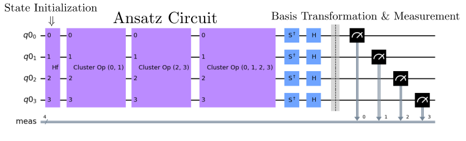
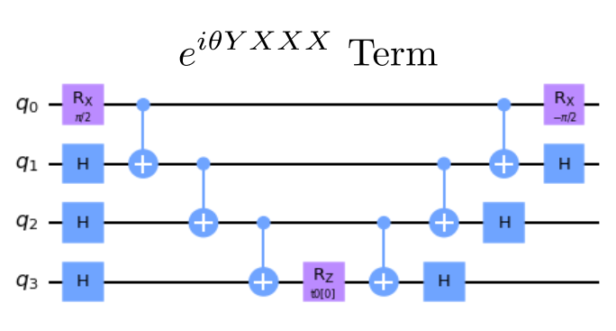

# Variational Quantum Eigensolver - Prototype Benchmark Program

Solving the electronic structure problem is one of the most promising near-term applications for quantum computers, with 
potential contributions to drug discovery [[1]](#references), developing new materials
and catalysts for more efficient light-harvesting and CO2 reduction [[2]](#references), understanding high-temperature super conductivity [[1]](#references), and other important use cases [[3]](#references). In the NISQ era, one of the most promising approach is the variational quantum eigensolver (VQE) [[4]](#references) [[5]](#references). In the current version of this benchmark, we compare the quantum simulation against a classical simultion of the same circuit in order to report our fidelity. This works well for small circuit sizes, but is not scalable past a certain number of qubits.

## Problem outline

VQE implements a parametrized circuit for a chosen wave function ansatz. It then measures the energy expectation
value of the wave function and optimizes the circuit parameters towards a direction that lowers the energy expectation
value. Comparing with other approaches such as the quantum phase estimation (QPE), VQE requires shallower circuit
depths, which makes it particularly suitable for near-term quantum computers.

The center of the VQE algorithm is the choice of the wave function ansatz. Many choices exist, and in this benchmark
we choose to use the unitary Coupled Cluster with singles and doubles ansatz (unitary-CCSD). This ansatz is 
defined as [[6]](#references)

in which  is the cluster operator, 
"/> is the reference state, 
which is choosen to be the Hartree-Fock (HF) state. 

The cluster operator is defined as 

in which  are the Fermionic
annihilation and creation operators, 
indicates molecular orbitals that are occupied in the HF state, and 
indicates molecular orbitals that are empty in the HF state. 
and  are the wave function
parameters associated with single and double excitations. 

The energy expectation value of the unitary-CCSD ansatz is computed as 

in which the second equlity holds since the wave function is normalized, and 
is the electronic Hamiltonian. The electronic Hamiltonian is defined as,

in which  are the
one- and two-electron integrals. 

The VQE algorithm proceeds by iteratively evaluating and optimizing the energy by varying the wave function 
parameters, until the minimum is found. 

## Benchmarking
The VQE algorithm is benchmarked in method 1 by evaluating `max_circuits` different parameters for individual circuits from the VQE algorithm and in method 2 by evaluating all circuits for a single choice of parameters in VQE. These two methods are further explained in the [Circuit Methods](#circuit-methods) section. Each circuit is repeated a number of times denoted by `num_shots`. We then run the algorithm circuit for even numbers of qubits between `min_qubits` and `max_qubits`, inclusive. The test returns the averages of the circuit creation times, average execution times, fidelities, and circuit depths, like all of the other algorithms. For this algorithm's fidelity calculation, we compare against the results returned from classical simulation using our [noise-normalized fidelity calculation](../_doc/POLARIZATION_FIDELITY.md), with an additional rescaling.

As the energy is a weighted sum of tensor product of Pauli matrices, we scale the fidelity of each term 
in the Hamiltonian by its corresponding weights . 
The overall fidelity is computed as 

in which  is the 
normalization factor to make sure that the fidelity is between 0 and 1. 
is the Helliger fidelity for the th term. 
The fidelity calculated in this way would reflect the accuracy in the energy evaluation, as the term with largest 
energy contribution also contributes to the overall fidelity the most. 

We calculate the expected distributions in the jupyter notebook `precalculated_data.ipynb`, which stores the results for up 
to 10 qubits in the `precalculated_data.json` data file. The python code then imports the distributions from the `json` file.

## Classical algorithm

There is no known classical algorithm that is capable of computing the energy for the unitary-CCSD ansatz with 
polynomial scaling cost. However, the unitary-CCSD ansatz has attracted a great deal of interests in quantum 
chemistry [[7]](#references) since it is known to be a highly accurate approximation to strongly correlated systems. Being capable 
to accurately predict strongly correlated has the potential to benefit numerous fields of great importance, 
such as high-temperature superconductivity, catalyst with transition metals, and light-harvesting materials. 

## Quantum algorithm

As the number of terms in the unitary-CCSD ansatz is polynomial in system size, and the transformation we use is also polynomial, the quantum algorithm is therefore polynomial.

### Mapping from Fermions to Qubits

The unitary-CCSD ansatz and the Hamiltonian are defined with Fermonic operators. We use the Jordan-Wigner transformation
(JWT) to convert them to the qubit space. The JWT is defined as [[8]](#references)

,

By applying the JWT for the unitary-CCSD ansatz becomes

in which  are the amplitudes and 
 are the tensor product of 
Pauli matrices. Similarly, the Hamiltonian becomes 

.

Although we do know how to implement 
on the quantum computer, there is no simple way to implement .
Therefore, we apply the first-order Trotter approximation [[9]](#references), 

.

This is a only an approximation since in general 
do not commute. In the [Hamiltonian Simulation benchmark](../hamiltonian-simulation/), we used the Trotter approximation to 3rd order by default. By applying the first-order Trotter approximation, the resulting ansatz is called the 
disentangled unitary-CCSD ansatz. 

For a single excitation in the cluster operator, the JWT converts it to

,

For a double excitation, the JWT converts it to

### Energy Mesurements

As mentioned, the Hamiltonian becomes a weighted sum of tensor product of Pauli matrices upon the JWT conversion. The transformed
Hamiltonian contains three types of terms: 1) the identity term that only includes the identity matrix (e.g. IIII); 2) the 
diagonal terms that only include I and Z matrices (e.g. ZIII); 3) the off-diagonal terms that include X and Y matrices (e.g. XXXY).
We do not need to compute the identity term, and only need one circuit to compute all the diagonal terms. However, in general for each different 
off-diagonal term, we need a different quantum circuit to compute its expectation value. As we can only measure in the 
computational basis, each off-diagonal term needs different basis rotation at the end of the circuit to rotate it 
to the computation basis.

### General Quantum Circuit

Below is the general circuit. We have our initialization using the Hartree-Fock state and then the cluster OPs for the single excitations from 0 to 1 and 2 to 3 orbitals as well as the double excitation from the 0,1 to 2,3 orbitals. In this case, we are measuring the YYYY off-diagonal term, so we need to shift to the basis of this term before measuring.

### Algorithm Steps

1. Construct the electronic Hamiltonian for the NaH molecule

2. Initialize qubits in the HF state

3. Build the unitary-CCSD ansatz

4. Add basis rotations to the off-diagonal term 

5. Measure out all of the qubits

### Number of Measurements

One thing worth noting is that as VQE computes some expectation values with statistical averaging, the statistical
error in the computed expectation value scales as , 
in which  is the number of measurements. 
In this way one could see that the number of measurements scales as . 
Therefore VQE requires a larger number of measurements than the other benchmarks, such as the quantum phase estimation. 

## Gate Implementation

As an example, the term 
could be implemented with the following circuit. [[10]](#references)

*Fig 1. The circuit that implements  term. The first 4 single qubit 
gates rotate from the computational basis to X and Y basis. It is followed by the CNOT ladder to compute parity and store it in the last qubit. We then
perform the angle rotation by , and undo
the parity calculation and the basis rotation.*

## Circuit Methods

The full VQE algorithm is quite complicated due to its dependence classical optimization methods. In order to simplify 
the algorithm for benchmarking purposes, we only test how accurate it is for a given ansatz to compute the full or
part of the energy expectation value. To be more specifically, two methods are implemented: 

- **Method 1** We vary the ansatz parameters by random sampling and compute the expectation value of the first non-identity term in the Hamiltonian. 

- **Method 2** We fix the ansatz parameters and compute the full energy expectation value. 

The method may be passed to the run() function, using the `method=method` parameter, where method can be 1 or 2. 
 
## References

[1] Sam McArdle, Suguru Endo, Alan Aspuru-Guzik, Simon Benjamin, Xiao Yuan. (2020).
    Quantum computational chemistry.
    [`arXiv:1808.10402`](https://arxiv.org/abs/1808.10402)

[2] Vera von Burg, Guang Hao Low, Thomas Häner, Damian S. Steiger, Markus Reiher, Martin Roetteler, Matthias Troyer. (2021).
    Quantum computing enhanced computational catalysis.
    [`arXiv:2007.14460`](https://arxiv.org/abs/2007.14460)

[3] Markus Reiher, Nathan Wiebe, Krysta M Svore, Dave Wecker, Matthias Troyer
    Elucidating Reaction Mechanisms on Quantum Computers
    [`arXiv:1605.03590`](https://arxiv.org/abs/1605.03590)

[4] Alberto Peruzzo, Jarrod McClean, Peter Shadbolt, Man-Hong Yung, Xiao-Qi Zhou, Peter J. Love, Alán Aspuru-Guzik, Jeremy L. O'Brien. (2013). 
    A variational eigenvalue solver on a quantum processor.
    [`arXiv:1304.3061`](https://arxiv.org/abs/1304.3061v1)

[5] Jarrod R. McClean, Jonathan Romero, Ryan Babbush, Alán Aspuru-Guzik. (2016).
    The theory of variational hybrid quantum-classical algorithms.
    [`arXiv:1509.04279`](https://arxiv.org/abs/1509.04279)

[6] Yudong Cao, Jonathan Romero, Jonathan P. Olson, Matthias Degroote, Peter D. Johnson, Mária Kieferová, Ian D. Kivlichan, Tim Menke, Borja Peropadre, Nicolas P. D. Sawaya, Sukin Sim, Libor Veis, Alán Aspuru-Guzik. (2018).
    Quantum Chemistry in the Age of Quantum Computing.
    [`arXiv:1812.09976`](https://arxiv.org/abs/1812.09976)
    
[7] Bridgette Cooper and Peter J. Knowles.
    Benchmark Studies of Variational, Unitary and Extended Coupled Cluster Methods.
    J. Chem. Phys. 133, 234102 (2010); [`10.1063/1.3520564`](https://doi.org/10.1063/1.3520564)

[8] Google Open Fermion Documentation Team. (2021). 
    [`The Jordan-Wigner and Bravyi-Kitaev Transforms`](https://quantumai.google/openfermion/tutorials/jordan_wigner_and_bravyi_kitaev_transforms)

[9] Naomichi Hatano, Masuo Suzuki. (2005).
    Finding Exponential Product Formulas of Higher Orders
    [`arXiv:math-ph/0506007`](https://arxiv.org/abs/math-ph/0506007v1)

[10] Panagiotis Kl. Barkoutsos, Jerome F. Gonthier, Igor Sokolov, Nikolaj Moll, Gian Salis, Andreas Fuhrer, Marc Ganzhorn, Daniel J. Egger, Matthias Troyer, Antonio Mezzacapo, Stefan Filipp, Ivano Tavernelli. (2018).
    Quantum Algorithms for Electronic Structure Calculations: Particle-Hole Hamiltonian and Optimized Wave-Function Expansions
    [`arXiv:1805.04340`](https://arxiv.org/abs/1805.04340)
